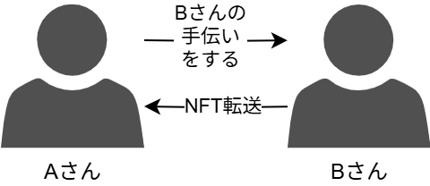
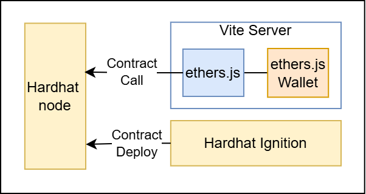
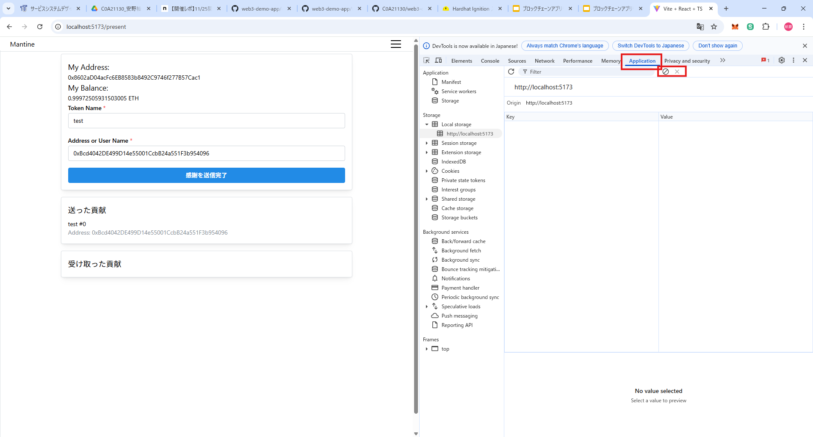

# web3-demo-app

本アプリケーションではEthereum系ブロックチェーンを活用したアプリケーションの基盤構築とデモンストレーションを目的としている。
現在は研究室内でEthereum系ブロックチェーンを活用したアプリケーション構築が主流になっている。
Ethereum系ブロックチェーンにおけるエコシステムでは、EVM(Ethereum Virtual Machine)によるスマートコントラクトとフロントエンドシステムを活用したWeb3サービスを構築する。

## Overview

### Application

NFT交換システムでは最もシンプルなNFT交換を実現する。
本サービスでは研究室内の貢献に応じてNFTを発行・転送をする。
例として自分の研究以外の活動として「研究メンバーのために論文を探してあげる」ことなどの研究の手伝いをすることがある。
このような場合に、感謝と同時にNFTを送ることで研究室の貢献度を可視化する。



## System Architecture

開発環境のシステム構成について紹介する。まずスマートコントラクトのソースコードを開発・テストする。ブロックチェーンの仮想環境に対して、開発したスマートコントラクトをデプロイする。デプロイしたスマートコントラクトをフロントエンドから呼び出すことで、取引が実行される。



- Hardhat：Ethereumのスマートコントラクト開発を効率的に行うための開発環境。Solidityコードをコンパイルやスマートコントラクトコードのテストによる検証が可能である。
  - Node：スマートコントラクトを実行するための仮想ブロックチェーン環境。
  - Ignition：スマートコントラクトをデプロイメントする。
- Vite Server：フロントエンドの開発環境。
- ethers.js：Ethereumブロックチェーンとのやり取りを簡単に行えるJavaScriptライブラリ。ブロックチェーンとやり取りをして、スマートコントラクトを呼び出す。
  - Wallet：ウォレット管理やトランザクション署名機能を提供する。

本番環境ついては以下のリポジトリを参照する。
- Blockchain: [Web3 Infrastructure for Blockchain](https://github.com/c0a22098ea/web3-infrastructure/tree/main/blockchain)
- IPFS: [Web3 Infrastructure for Ipfs](https://github.com/c0a22098ea/web3-infrastructure)

## Directory Structure

このプロジェクトは、スマートコントラクトとフロントエンドを組み合わせた Web3アプリケーションである。
`contracts/` ディレクトリにはスマートコントラクトに関するコードが含まれ、`frontend/` ディレクトリにはフロントエンド コードが含まれている。

```
.gitignore
.nvmrc # nodeのバージョンを設定
README.md # リポジトリの仕様を記載
.github/ # GitHub ActionによるCI設定を記載
contracts/
  hardhat.config.ts # Hardhatの設定
  package.json # ライブラリやプロジェクトの設定を管理
  README.md # スマートコントラクトに関する仕様やセットアップ方法を記載
  tsconfig.json
  contracts/ # スマートコントラクトのソースコード
  ignition/ # スマートコントラクトのデプロイに関するソースコード
  test/ # スマートコントラクトのテストコード
frontend/
  eslint.config.js
  index.html
  jest.config.js
  package.json # ライブラリやプロジェクトの設定を管理
  README.md # フロントエンドに関する仕様やセットアップ方法を記載
  tsconfig.json 
  vite.config.mts
  src/ # フロントエンドのソースコード
    components/ # スマートコントラクトの呼び出しやUIの要素に関するコード
    pages/ # UIに関するコード
  test/ # テストコード
```

### Main Directories

- **`contracts/`**  
  スマートコントラクトの開発やテストを行う。`Hardhat`を使用して開発されている。詳細は[README](https://github.com/C0A21130/web3-demo-app/blob/main/contracts/README.md)を参照する。
  
- **`frontend/`**  
  フロントエンドのシステムに関するソースコード。`Vite`を使用してシステムを構築し、`ethers.js`でスマートコントラクトの呼び出しをしている。詳細は[README](https://github.com/C0A21130/web3-demo-app/blob/main/frontend/README.md)を参照する。

## Setup

### Required Tools

- Node.js (推奨バージョンについては `.nvmrc` を参照する)
- npm
- Solidity (スマートコントラクトのバージョンについては、`./contracts/hardhat.config.ts`を参照する)
- Hardhat (v2)
- ethers.js (v6)
- Vite (v6)

### Installation Steps

以下にアプリケーションを仮想ブロックチェーンの環境で起動する方法について説明する。

0. nvmのインストール。
   すでにインストール済みの場合は次のステップに進む。
   詳しいインストール方法は[nvmリポジトリのInstalling and Updating](https://github.com/nvm-sh/nvm?tab=readme-ov-file#installing-and-updating)を参照する。

   ```bash
   curl -o- https://raw.githubusercontent.com/nvm-sh/nvm/v0.40.2/install.sh | bash
   source ~/.bashrc
   ```

1. リポジトリをクローンし、nodeのバージョンを設定する。

   ```bash
   git clone https://github.com/C0A21130/web3-demo-app.git
   cd web3-demo-app
   nvm use
   ```

2. npmライブラリにおける必要な依存関係をインストールする。

   ```bash
   # For the contracts directory
   cd contracts
   npm install
   ```

   ```bash
   # For the frontend directory
   cd ../frontend
   npm install
   ```

3. 仮想のブロックチェーンを起動する。
   ```bash
   cd contracts
   npx hardhat node
   ```

4. 別のターミナルを開いて、スマートコントラクトをデプロイする。
   ```bash
   cd contracts
   npx hardhat compile
   npx hardhat ignition deploy ignition/modules/SsdlabToken.ts --network localhost
   ```

5. 別のターミナルを開いて、フロントエンドのサーバーを起動する。
   ブラウザで[http://localhost:5173](http://localhost:5173)を開いてアプリケーションを表示する。
   ```bash
   cd frontend
   npm run dev
   ```

6. もし秘密鍵やユーザー名を初期化する場合は、LocalStorageを消去する。
   ブラウザの開発者ツール(F12)を開き、Applicationタブを開きClear ALLをクリックする。
   

## CI/CD

このプロジェクトではCI/CDにGitHub Actionsを使用している。
設定ファイルは次の場所 [`.github/workflows/ci.yml`](.github/workflows/ci.yml)にある。

