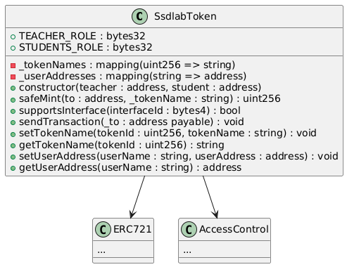
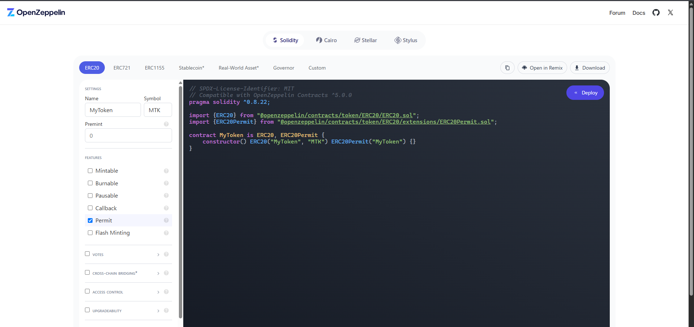

# Contract Development

## Smart Contracts

スマートコントラクトは `contracts/`ディレクトリの直下の `contracts/contracts` に配置する。
スマートコントラクトの説明を行う。
- Lock.solは初期化時に作成されるコントラクトである。
- SsdlabToken.solはERC721を継承し、デモアプリで必要となるマップ機能と送金機能のコードを追加したコードである

　

  - tokenNames,userAddresses:ユーザのニックネームとユーザアドレスを紐づけることで、ユーザのニックネームをユーザアドレスとして処理することができる
  - constructor:コントラクトをデプロイする際に、管理者（teacher）と学生（student）のアドレスを設定する
  - safeMint:アドレスとトークンの名前を使いNFTを発行する
  - supportsInterface:supportsInterface をオーバーライドし、コントラクトが特定のインターフェースをサポートしているかどうかを確認するために使用する
  - sendtransaction:トークンを送金するために使用する
  - setTokenName:トークンの名前を設定する
  - getTokenName:トークンの名前を取得する
  - setUserAddress:ユーザアドレスを辞書に登録する
  - getUserAddress:ユーザアドレスを辞書から取得する

## Set Up

### Test Smart Contracts

[Hardhat Test](https://hardhat.org/tutorial/testing-contracts) を活用することでスマートコントラクトの動作検証が可能である。
必ず作成したスマートコントラクトはテストで動作確認してから、フロントエンドと連携することを推奨する。

ディレクトリを変更する
```bash
cd contracts
```

テストを実行する
```bash
npx hardhat test
```

#### Create Test Code

テストコードは `contracts/test` にTypeScriptのファイルとして作成する。
MochaとChaiを活用してテストコードを作成する。

書き方
- it：一つのテストを記述する
    ```ts
    it("テスト名", function() {
      // テストを記述
    })
    ```
- describe：テストを複数記述する
    ```ts
    describe("テスト名", function() {
      it("テスト1", function() {
        // テストを記述
      })

      it("テスト2", function() {
        // テストを記述
      })
    })
    ```
- toBe：オブジェクトの等価判定をする
    ```ts
    expect("ABC").toBe("ABC") // True
    expect("ABC").toBe("ABD") // False
    expect(1+1).toBe(2) // True
    ```
- connect：ウォレット(Wallet)やプロバイダー(Provider)、署名者(Signer)をネットワークに接続するためのメソッド。コントラクトを実行するユーザーを変更することができる。
    ```ts
    contract.connect(<Wallet | Provider | Signer>).method();
    ```
    例)
    ```ts
    contract.connect(account1).safeMint(account1.address);
    ```

参考のURL
- [TypeScriptを使用してMochaとChaiでテストを書き、nycを用いてカバレッジを取得してみた](https://dev.classmethod.jp/articles/mocha_chai_nyc_with_ts/#toc-1)
- [Jestのexpect(matcher)を完全に理解する](https://zenn.dev/t_poyo/articles/4c47373e364718)

- SsdlabToken.ts: NFTのミントと正常に発行できているかを確認する
- TransferEther.ts: トークンを特定のアドレスに送金するテストコードである
- TransferNFT.ts: NFTが正常に交換できているかを確認するテストコードである

### Start Up Blockchain

[Hardhat Node](https://hardhat.org/hardhat-network/docs/overview)では、仮想のブロックチェーン環境を構築することが可能である。
Hardhatでは仮想ブロックチェーン環境と20のアカウントが作成される。
以下に仮想ブロックチェーン環境の起動方法を説明する。

ディレクトリを変更する
```bash
cd contracts
```

ブロックチェーンを起動する
```bash
npx hardhat node
```

### Deploy Smart Contracts

コントラクトをブロックチェーンにデプロイするには、[Hardhat Ignition](https://hardhat.org/ignition/docs/getting-started#overview)を使用する。


1. ディレクトリを移動する
    ```bash
    cd contracts
    ```

2. スマートコントラクトをコンパイルする。
    ```bash
    npx hardhat compile
    ```

3. `ignition/modules/`ディレクトリ内にスマートコントラクトデプロイ用のignitionファイルを作成する。
    例)
    ```ts
    // This setup uses Hardhat Ignition to manage smart contract deployments.
    // Learn more about it at https://hardhat.org/ignition

    import { buildModule } from "@nomicfoundation/hardhat-ignition/modules";

    const <IGNITION MODULE NAME> = buildModule("<IGNITION MODULE NAME>", (m) => {

        const <CONTRACT NAME> = m.contract("<CONTRACT NAME>", []);

        return { <CONTRACT NAME> };
    });

    export default <IGNITION MODULE NAME>;
    ```

4. 別のターミナルを開いて、スマートコントラクトをデプロイする
    ```bash
    npx hardhat ignition deploy ignition/modules/<CONTRACT_NAME>.ts --network <NETWORK_NAME>
    ```
    例) 
    ```bash
    npx hardhat ignition deploy ignition/modules/SsdlabToken.ts --network localhost
    ```

    デプロイに成功すると下記のようなログが出力されるため、コントラクトアドレスをメモする。
    ```
    Hardhat Ignition
    Deploying [ <IGNITION MODULE NAME> ]
    Batch #1
    Executed <IGNITION MODULE NAME>#<CONTRACT NAME>
    [ <IGNITION MODULE NAME> ] successfully deployed
    Deployed Addresses
    <IGNITION MODULE NAME>#<CONTRACT NAME> - <CONTRACT ADDRESS>
    ```

## Example

### Develop Smart Contract

OpenZeppelinの[Contract Wizard](https://wizard.openzeppelin.com/)を基にスマートコントラクトを開発する。
Contract WizardではERC20、ERC721、ERC1155などのスマートコントラクトの機能をUI上で組み合わせて実装することが可能である。



- 課題1: Contract Wizardを利用してERC721のソースコードを作成する。
  - 問題1: Contract WizardのUIを操作してERC721のソースコードを作成する。
  必ずNFTの発行(Mint)の関数が存在するようにする。

- 課題2: 作成したERC721をコンパイルする
  - 問題1: Contract Wizardを利用して作成したソースコードを `cotracts/contracts` ディレクトリにコピーし、Hardhatを利用してコンパイルする。
  - 問題2: コンパイルすると `contracts/artifacts` 内にバイナリファイルやABIファイルが作成される。
  コンパイルが成功したことを確認する。

### Develop Test Code

- 課題1: NFTの発行
自身で作成したスマートコントラクトを使用して、以下の条件を満たすテストコードを作成する。
テストコードは `contracts/test`にTypeScriptのファイルで新規作成する。
作成するファイル名はスマートコントラクトと同名であることを推奨する。
  - 問題1: NFT1の発行
  オーナー（owner）がNFTを発行する。
  - 問題 2: NFTの送信
  オーナーが発行したNFTを Aさん に送信する。
  Aさん が受け取ったNFTの所有者であることを確認する。
  - 問題 3: NFTの再送信
  Aさん が受け取ったNFTを Bさん に送信する。
  Bさん が受け取ったNFTの所有者であることを確認する。

- 課題2: Aさんが発行したNFTをBさんに送信する。
  - 問題1: NFTの発行
  オーナー（owner）がAさんのアドレスにNFTを発行する。
  - 問題 2: NFTの送信
  AさんのNFTを Bさん に送信する。
  Bさん が受け取ったNFTの所有者であることを確認する。

テストコードの書き方の例)
```ts
import { loadFixture } from "@nomicfoundation/hardhat-network-helpers";
import { expect } from "chai";
import { ethers } from "hardhat";

// スマートコントラクトのデプロイ
async function deployFixture() {
  const [owner, account1, account2] = await ethers.getSigners();
  const contract = await ethers.deployContract("<自身で作成したコントラクト名>", ["<引数>"]);
  return { contract, owner, account1, account2 };
}

describe("課題1", function () {
  it("問題1", function () {
    // オーナー（owner）がNFTを発行するテスト
  })

  it("問題2", function () {
    // オーナーが発行したNFTを Aさん に送信するテスト
  })
})

describe("課題2", function () {
  it("問題1", function () {
    // オーナー（owner）がAさんのアドレスにNFTを発行するテスト
  })
})

```

## Reference
- ethres, https://docs.ethers.org/v6/
- hardhat, https://hardhat.org/
