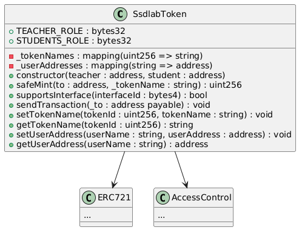

# Contract Development

## Hardhat Commands

- Compile the contracts:

  ```bash
  npx hardhat compile
  ```

- Run tests:

  ```bash
  npx hardhat test
  ```

- Start a local network:

  ```bash
  npx hardhat node

## Smart Contracts

スマートコントラクトはContractsディレクトリの直下に配置する
スマートコントラクトの説明を行う
・Lock.solは初期化時に作成されるコントラクトである
・SsdlabToken.solはERC721を継承し、デモアプリで必要となるマップ機能と送金機能のコードを追加したコードである
　
　・tokenNames,userAddresses:ユーザのニックネームとユーザアドレスを紐づけることで、ユーザのニックネームをユーザアドレスとして処理することができる
　・constructor:コントラクトをデプロイする際に、管理者（teacher）と学生（student）のアドレスを設定する
　・safeMint:アドレスとトークンの名前を使いNFTを発行する
　・supportsInterface:supportsInterface をオーバーライドし、コントラクトが特定のインターフェースをサポートしているかどうかを確認するために使用する
・sendtransaction:トークンを送金するために使用する
・setTokenName:トークンの名前を設定する
・getTokenName:トークンの名前を取得する
・setUserAddress:ユーザアドレスを辞書に登録する
・getUserAddress:ユーザアドレスを辞書から取得する

## Test Smart Contracts

```bash
cd contracts
```

```bash
npx hardhat test
```

・SsdlabToken.ts:NFTのミントと正常に発行できているかを確認する
・TransferEther.ts:トークンを特定のアドレスに送金するテストコードである
・TransferNFT.ts:NFTが正常に交換できているかを確認するテストコードである
## Start Up Blockchain

```bash
cd contracts
```

ブロックチェーンを起動する。

```bash
npx hardhat node
```

## Deploy Smart Contracts

Use `contracts/scripts/deploy.ts` to deploy the contracts.

```bash
cd contracts
```

別のターミナルを開いて、スマートコントラクトをデプロイする

```bash
npx hardhat deploy ignition ignition/module/SsdlabToken.ts
```

## Example

### Develop Smart Contract
Wizardをみてね
ERC721
https://wizard.openzeppelin.com/

### Develop Test Code
課題1: NFTの発行
SsdlabToken コントラクトを使用して、以下の条件を満たすテストコードを作成してください。
問題1:NFT1の発行
オーナー（owner）がNFTを発行する。

問題 2: NFTの送信
オーナーが発行したNFTを Aさん に送信する。
Aさん が受け取ったNFTの所有者であることを確認する。

問題 3: NFTの再送信
Aさん が受け取ったNFTを Bさん に送信する。
Bさん が受け取ったNFTの所有者であることを確認する。

課題2:Aさんが発行したNFTをBさんに送信してください
い。
問題1:NFT1の発行
オーナー（owner）がAさんのアドレスにNFTを発行する。

問題 2: NFTの送信
AさんのNFTを Bさん に送信する。
Bさん が受け取ったNFTの所有者であることを確認する。