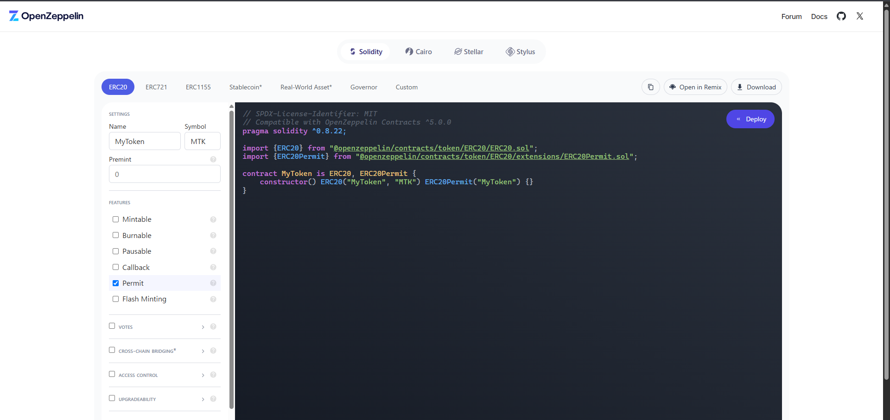

# Contract Development

## Smart Contracts

スマートコントラクトは `contracts/`ディレクトリの直下の `contracts/contracts` に配置する。
スマートコントラクトの説明を行う。
- Lock.solは初期化時に作成されるコントラクトである。
- SsdlabToken.solはERC721を継承し、デモアプリで必要となるマップ機能と送金機能のコードを追加したコードである

　

  - tokenNames,userAddresses:ユーザのニックネームとユーザアドレスを紐づけることで、ユーザのニックネームをユーザアドレスとして処理することができる
  - constructor:コントラクトをデプロイする際に、管理者（teacher）と学生（student）のアドレスを設定する
  - safeMint:アドレスとトークンの名前を使いNFTを発行する
  - supportsInterface:supportsInterface をオーバーライドし、コントラクトが特定のインターフェースをサポートしているかどうかを確認するために使用する
  - sendtransaction:トークンを送金するために使用する
  - setTokenName:トークンの名前を設定する
  - getTokenName:トークンの名前を取得する
  - setUserAddress:ユーザアドレスを辞書に登録する
  - getUserAddress:ユーザアドレスを辞書から取得する

## Set Up

### Test Smart Contracts

[Hardhat Test](https://hardhat.org/tutorial/testing-contracts) を活用することでスマートコントラクトの動作検証が可能である。
必ず作成したスマートコントラクトはテストで動作確認してから、フロントエンドと連携することを推奨する。

ディレクトリを変更する
```bash
cd contracts
```

テストを実行する
```bash
npx hardhat test
```

#### 作成したテストコード
- SsdlabToken.ts:NFTのミントと正常に発行できているかを確認する
- TransferEther.ts:トークンを特定のアドレスに送金するテストコードである
- TransferNFT.ts:NFTが正常に交換できているかを確認するテストコードである

### Deploy Smart Contracts

コントラクトをブロックチェーンにデプロイするには、[Hardhat Ignition](https://hardhat.org/ignition/docs/getting-started#overview)を使用する。


ディレクトリを変更する
```bash
cd contracts
```

別のターミナルを開いて、スマートコントラクトをデプロイする
```bash
npx hardhat deploy ignition ignition/module/SsdlabToken.ts
```

### Start Up Blockchain

[Hardhat Node](https://hardhat.org/hardhat-network/docs/overview)では、仮想のブロックチェーン環境を構築することが可能である。
Hardhatでは仮想ブロックチェーン環境と20のアカウントが作成される。
以下に仮想ブロックチェーン環境の起動方法を説明する。

ディレクトリを変更する
```bash
cd contracts
```

ブロックチェーンを起動する
```bash
npx hardhat node
```

## Example

### Develop Smart Contract

OpenZeppelinの[Contract Wizard](https://wizard.openzeppelin.com/)を基にスマートコントラクトを開発する。
Contract WizardではERC20、ERC721、ERC1155などのスマートコントラクトの機能をUI上で組み合わせて実装することが可能である。



- 課題1: Contract Wizardを利用してERC721のソースコードを作成してください
  - 問題1: Contract WizardのUIを操作してERC721のソースコードを作成する。
  必ずNFTの発行(Mint)の関数が存在するようにしてください。

- 課題2: 作成したERC721をコンパイルする
  - 問題1: Contract Wizardを利用して作成したソースコードを `cotracts/contracts` ディレクトリにコピーし、Hardhatを利用してコンパイルしてください。
  - 問題2: コンパイルすると `contracts/artifacts` 内にバイナリファイルやABIファイルが作成される。
  コンパイルが成功したことを確認する

### Develop Test Code

- 課題1: NFTの発行
SsdlabToken コントラクトを使用して、以下の条件を満たすテストコードを作成してください。
  - 問題1: NFT1の発行
  オーナー（owner）がNFTを発行する。
  - 問題 2: NFTの送信
  オーナーが発行したNFTを Aさん に送信する。
  Aさん が受け取ったNFTの所有者であることを確認する。
  - 問題 3: NFTの再送信
  Aさん が受け取ったNFTを Bさん に送信する。
  Bさん が受け取ったNFTの所有者であることを確認する。

- 課題2:Aさんが発行したNFTをBさんに送信してください
い。
  - 問題1: NFT1の発行
  オーナー（owner）がAさんのアドレスにNFTを発行する。
  - 問題 2: NFTの送信
  AさんのNFTを Bさん に送信する。
  Bさん が受け取ったNFTの所有者であることを確認する。