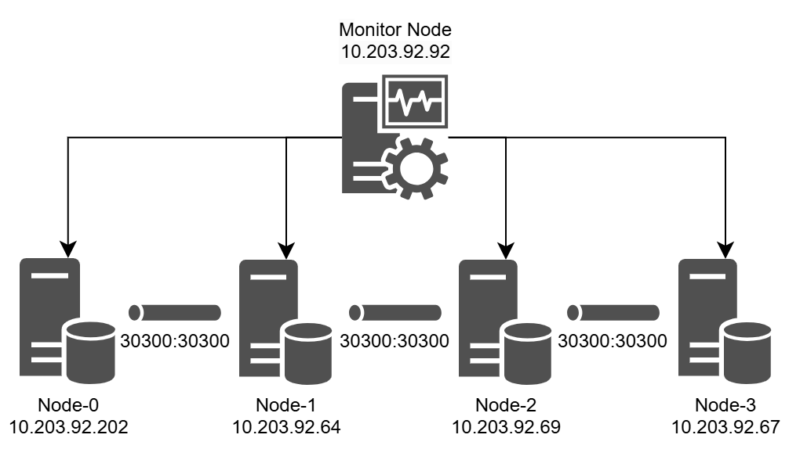

# Monitor

## Overview

ブロックチェーンの監視環境構築の方法について説明する。
本システムでは、プライベートのEthereum系ブロックチェーンの監視環境を構築する。

- ブロックチェーン環境仕様書: [blockchain.md](./blockchian.md)
- 監視環境仕様書: [monitor.md](./monitor.md)

## Monitoring system architecture

監視用ノードは、以下の2つのシステムで構成されている。


1. **Block explorer**：
    [Quorum Explorer](https://github.com/Consensys/quorum-explorer)はQuorumブロックチェーンネットワークの監視や管理を行うためのツールである。
    ノードの稼働状況やトランザクションの進行状況、送信されたトランザクションの詳細や履歴を追跡することが可能である。
    稼働していブロックチェーンノードのJSON-RPCへアクセスしデータを取得する。
    [http://10.203.92.92:25000](http://10.203.92.92:25000/)からアクセス可能である。
2. **Metrics system**：
    Metrics Systemでは、ブロックチェーンノードの状態を受け取り、ダッシュボードで可視化するシステムである。
    監視可能なメトリクスとしてCPUやメモリ、ディスク、ネットワーク、トランザクションの状態などが存在する。
    Geth Clientから送信されたシステムの状態を時系列データベース(InfluxDB)に保存し、蓄積されたデータをダッシュボード(Grafana)で可視化する。
    [http://10.203.92.92:8085](http://10.203.92.92:8085/)からアクセス可能である。

## Monitoring nodes

ブロックチェーンノードのシステムの状態を監視するためのノードである。



Monitor Node
- 監視用ノード
- IPアドレス：10.203.92.92
- OS：Ubuntu20.04
- ポート
    - 25000(Block Explorer)
    - 8086(InfluxDB)
    - 8085(Grafana)
    - 22(SSH)

## Set up

ブロックチェーン監視環境をセットアップするために必要なツールついて説明する。

### Required Tools

監視ノード
- Docker
- docker-compose(v3)
- curl
- nvm
- node

### Install nvm

バイナリファイルをダウンロードする。
```bash
curl -o- https://raw.githubusercontent.com/nvm-sh/nvm/v0.40.2/install.sh | bash
```

`~/.bashrc` の設定を読み込む。
```bash
sourse ~/.bashrc
```

nvmを用いてnodeをインストール
```bash
nvm install v22.14.0
```

現在のnodeのバージョンを変更
```bash
nvm use v22.14.0
```

## Config

ブロックチェーン監視環境の設定方法について説明する。
以下がディレクトリ構成である

```bash
.
├── docker-compose.yml
├── explorer/ 
│   ├── .env.production: 
│   └── config.json: 接続先のブロックチェーンノード等の設定ファイル
├── grafana/
└── influxdb2/
```

### Block Explorer

エクスプローラーのノードの接続先とアプリケーションのパラメータを設定する。
まずquorum-explorerのコンテナを起動するdocker-compose.ymlを作成する。
作成例は本レポジトリの[docker-compose.yml](./docker-compose.yml)を参考にする。

`explorer/config.json` の設定ファイルを接続先のブロックチェーンノードに変更する。
変更例は本リポジトリの[config.json](./config.json)を参照する。

`.env.production` の設定ファイルからアプリケーションを設定する。
変更例は本リポジトリの[.env.production](./.env.production)を参照する。

### Metrics system

まずInfluxDBとGrafanaのコンテナを起動するdocker-compose.ymlを作成する。
作成例は本レポジトリの `blockchain/docker-compose.yml` を参考にする。

コンテナを起動する。
```bash
docker-compose up -d
```

[http://localhost:8086](http://localhost:8086)にアクセスし、gethのbucketを作成する。
bucket名は`geth`とし、作成したBucketのIDをメモしておく。


つぎにv1におけるユーザーを設定することでこれにより外部からユーザー名・パスワードを利用してアクセスを可能にしておく。

コンテナのターミナルへアタッチする
```bash
docker-compose exec influxdb /bin/bash
```

ユーザー名とパスワードを設定する(BUCKET_IDは先ほどメモしたIDを指定する)
```bash
influx v1 auth create --username <USER_NAME> --password <PASSWORD> --read-bucket <BUCKET_ID> --write-bucket <BUCKET_ID>
```

最後にGrafanaを活用したダッシュボードの設定を行う。

まずInfluxDB([http://localhost:8085](http://localhost:8085))にアクセスしAPI Tokenの発行を行う。トークン名は自由だがかならずトークンはメモをとっておく。


次に[http://localhost:8085](http://localhost:8085)にアクセスし、GrafanaのDB接続設定を行う。
Data SourceからInfluxDBを選択し追加する。


接続先のURLには[http://localhost:8085](http://localhost:8085)、Organizationはorganization、Tokenは先ほどメモしたトークンを設定する。


その後Dashbordのタブをクリックし、新しいダッシュボードを作成する。
[geth-1747104319571.json](./geth-1747104319571.json)のファイルをインポートする。 

## Start Up

監視システムを起動する

```bash
docker-compose up -d
```

起動が完了したら、以下のURLからアクセスする
- 時系列DB(InfluDB)：[http://localhost:8086](http://localhost:8086)
- ダッシュボード(Grafana)：[http://localhost:8085](http://localhost:8085)

## Reference

- InfluxDB v2 のインストールや v1 からの移行について、https://tech.aptpod.co.jp/entry/2022/03/04/130000
- InfluxDB+Grafana構築 on docker、https://qiita.com/7280ayubihs/items/ace07b14d934dca4744c
