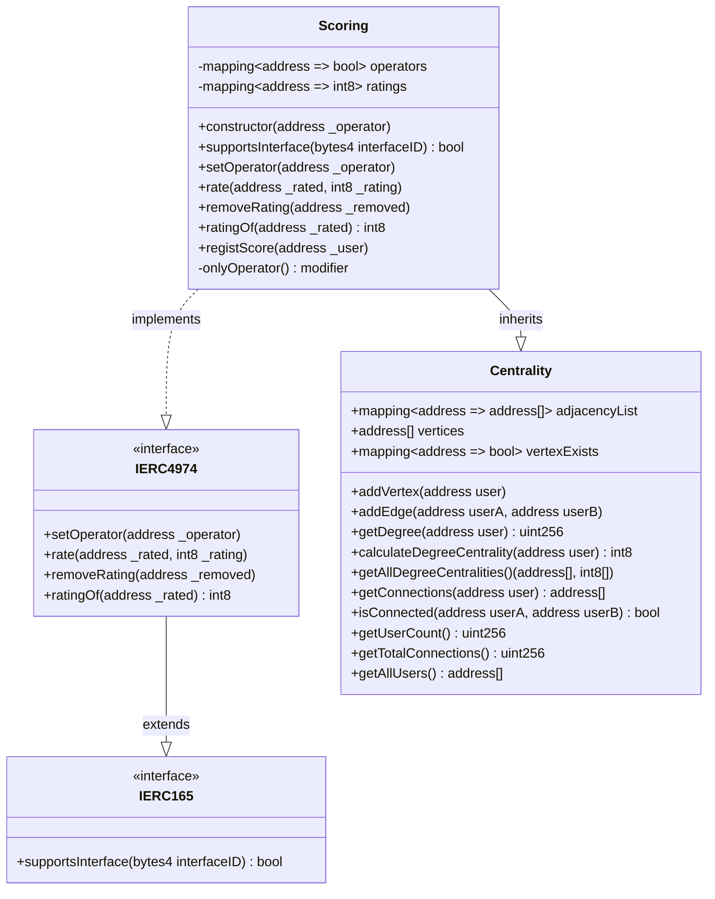

# Scoring

信用スコアリングシステムにおけるスマートコントラクトを用いたシステムである

1. ユーザー間の取引ネットワーク管理
2. 信用スコアの算出
3. 信用スコアの管理

## Overview

- [scoring.md](/docs/scoring.md): 開発仕様書
- [Scoring.sol](/contracts/contracts/scoring/Scoring.sol): 信用スコアリングシステムのメインコード
- [Scoring.ts](/contracts/test/scoring/Scoring.ts): Scoring.solのテストコード
- [Centrality.sol](/contracts/contracts/scoring/Centrality.sol): 取引ネットワークの管理と次数中心性算出をする
- [Centrality.ts](/contracts/test/scoring/Centrality.ts): Centrality.solのテストコード
- [IERC4974.sol](/contracts/contracts/scoring/IERC4974.sol): ERC4974のインターフェース



## Centrality

記号の定義
- 頂点: $V = \{ v_1, u_2, \dots, v_n \}$
- 辺: $E \subseteq \{ \{ u, v \} \mid u, v \in V \}$
- グラフ: $G = \{ V, E \}$
- 次数: 接続されている辺の数
    - $\deg(v) = |\{ e \in E \mid v \in e \}|$

次数中心性
- 次数が多い頂点を中心とする
    - 次数：頂点に対する辺の数
- 隣接する頂点の重みを一定とする
- 頂点$i$の次数中心性を$c_d(i)$とする

```math
c_{d}(v_i) = \frac{\deg(v_i)}{|V| - 1}
```

### Centrality.sol

Solidityで次数中心性を実装する際の設計方針：

1. **グラフデータ構造**
   - `mapping(address => address[]) public adjacencyList`: 隣接リストでユーザーアドレス間の接続を管理
   - `address[] public vertices`: 存在するユーザーアドレスのリスト
   - `mapping(address => bool) public vertexExists`: ユーザーアドレスの存在確認用

2. **主要関数**
   ```solidity
   // ユーザーアドレスを頂点として追加
   function addVertex(address user) public
   
   // ユーザー間の辺を追加（無向グラフ）
   function addEdge(address userA, address userB) public
   
   // 指定ユーザーの次数を取得
   function getDegree(address user) public view returns (uint256)
   
   // 指定ユーザーの次数中心性を計算（1000倍したuint256で返す）
   // 計算式: 次数中心性 = (ユーザーの次数 * 1000) / (総ユーザー数 - 1)
   function calculateDegreeCentrality(address user) public view returns (uint256)
   
   // 全ユーザーの次数中心性を計算
   function getAllDegreeCentralities() public view returns (address[] memory, uint256[] memory)
   
   // ユーザーの接続相手を取得
   function getConnections(address user) public view returns (address[] memory)
   ```

3. **実装上の考慮事項**
   - Solidityでは浮動小数点数が使えないため、1000倍して整数で扱う
   - ガス効率を考慮した隣接リスト構造を使用
   - 重複辺の防止機能を実装（同じユーザー間の重複接続を防ぐ）
   - イベントを使用してユーザー間の接続を記録
   - ゼロアドレス（0x0）の頂点追加を防ぐ
   - 自分自身への接続（自己ループ）を防ぐ

4. **イベント定義**
   ```solidity
   event UserAdded(address indexed user);
   event ConnectionAdded(address indexed userA, address indexed userB);
   event ConnectionRemoved(address indexed userA, address indexed userB);
   ```

### Centrality.ts

[Centrality.ts](/contracts/test/scoring/Centrality.ts)では[Centrality.sol](/contracts/contracts/scoring/Centrality.sol)の次数中心性に関するスマートコントラクトをテストする

Hardhatを使用したテストの設計方針：

1. **テストケース構成**
   - **基本機能テスト**: ユーザーアドレスの追加、ユーザー間接続の追加、次数計算
   - **次数中心性計算テスト**: 各種グラフパターンでの正確性検証
   - **エラーハンドリングテスト**: 存在しないユーザーへの操作、ゼロアドレス、自己ループ
   - **ガス効率テスト**: 大規模ユーザーネットワークでのガス消費量測定

2. **主要テストケース**

   **テスト環境設定**
   - Hardhat + Chai + ethers.jsを使用
   - 各テスト前にScoringコントラクトをデプロイ
   - 5つのユーザーアドレス（owner, addr1, addr2, addr3, addr4）を準備

   **基本機能テスト**
   - コントラクトのデプロイ確認
   - 初期状態でユーザー数が0であることを確認
   - ユーザーアドレスの追加機能
   - ユーザー間接続の追加・削除機能

   **次数中心性計算テスト**
   
   *線形グラフテスト（4ユーザー）*
   - 接続: addr1-addr2-addr3-addr4
   - 期待値: 
        - addr1（端点）: 333/1000 (33.3%)
        - addr2（中間）: 666/1000 (66.6%)
        - addr3（中間）: 666/1000 (66.6%)
        - addr4（端点）: 333/1000 (33.3%)

   *完全グラフテスト（4ユーザー）*
   - 接続: 全ユーザーが相互接続
   - 期待値: 全ユーザーで1000/1000 (100%)

   *星型グラフテスト（4ユーザー）*
   - 接続: 1人の中心ユーザーが他の3人と接続
   - 期待値:
        - 中心ユーザー: 1000/1000 (100%)
        - 周辺ユーザー: 333/1000 (33.3%)

   **エラーハンドリングテスト**
   - ゼロアドレス（0x0）の追加を拒否
   - 自己接続（同一ユーザー間の接続）を拒否
   - 存在しないユーザーの次数取得でエラー
   - 重複接続の追加を拒否

   **大規模ネットワークテスト**
   - 5ユーザー以上の複雑なネットワーク
   - ガス効率の確認
   - 計算精度の検証

   **補助機能テスト**
   - ユーザーの接続相手一覧取得
   - 総ユーザー数の取得
   - 総接続数の取得
   - 全ユーザーの次数中心性一括取得

3. **テスト実行コマンド**
   ```bash
   npx hardhat test test/Scoring.ts --gas-reporter
   ```

## Trust scoring

Trust ScoringではTrust Scoring Agentによる信用スコアの登録とスマートコントラクトによる取引履歴に基づく信用スコアの算出を行う

### Scoring.sol

[Scoring.sol](/contracts/contracts/scoring/Scoring.sol)は`Centrality.sol`と`IERC4974.sol`を継承し、信用スコアリングシステムの中核となるスマートコントラクトである

- **デュアルスコアリング**: 外部評価（Trust Score Agent）と内部評価（次数中心性）の並行管理
- **標準準拠**: ERC4974標準に完全準拠した評価システム
- **拡張性**: 新しいオペレーターの動的追加が可能
- **透明性**: すべての評価操作がブロックチェーン上で追跡可能

- **データ構造**
   ```solidity
   mapping(address => bool) private operators;    // Trust Score Agentの管理
   mapping(address => int8) private ratings;      // Trust Score Agentによる外部評価スコア (-127 ～ 127)
   mapping(address => int8) private scores;       // スマートコントラクトによる内部計算スコア
   ```
- **イベント追跡**
   - `NewOperator`: 新しいオペレーター追加時
   - `Rating`: スコア登録時
   - `Removal`: スコア削除時

**主要機能**

1. **オペレーター(Trust Scoring Agent)管理機能**
   - `constructor(address _operator)`: 初期オペレーター設定
   - `setOperator(address _operator)`: 新しいTrust Score Agentの追加
   - `onlyOperator` modifier: オペレーターのみ実行可能な関数の制御

2. **外部評価管理機能（ERC4974準拠）**
   - `rate(address _rated, int8 _rating)`: Trust Score Agentによるスコア登録
     - 評価範囲: -127 ～ 127（int8型）
   - `removeRating(address _removed)`: 登録済みスコアの削除
   - `ratingOf(address _rated)`: 外部評価スコアの取得

3. **内部評価算出機能**
   - `getScore(address _user)`: 次数中心性に基づく信用スコア取得
     - `Centrality.calculateDegreeCentrality()`を呼び出し
     - 取引ネットワークでの接続度合いを数値化
     - 戻り値: int8型（-128 ～ 127の範囲）

### IERC4974.sol

[IERC4974.sol](/contracts/contracts/scoring/IERC4974.sol)はTrust Scoring Agentが算出した信用スコアの値を`ERC4974`を用いて管理する

**ERC4974**
- Ethereumブロックチェーン上で数値評価を管理するための標準インターフェース
- 評価はint8型（-128～127の範囲）で管理され、ポジティブ・ネガティブ両方の評価が可能
- オペレーターが管理し、評価の付与・変更・削除を行える
    - 悪意のある評価操作を防ぐため、評価の更新・削除機能を提供
    - 評価を決める方法は実装者に委ねられている
- ERC165(コントラクトが特定のインターフェースをサポートしているか確認する仕組み)を継承している

URL
- Ethereum Improvement Proposals, ERC-4974: Ratings, https://eips.ethereum.org/EIPS/eip-4974
- Ethereum Improvement Proposals, ERC-165: Standard Interface Detection, https://eips.ethereum.org/EIPS/eip-165
