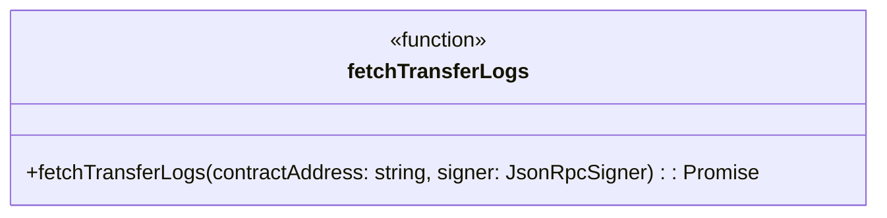
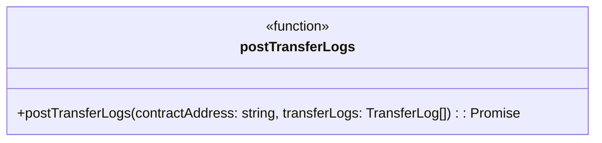
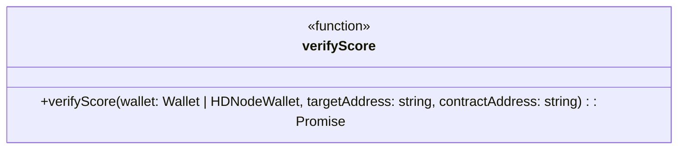

# Scoring

信用スコアリングシステムにおけるスマートコントラクトを用いたシステムである

1. ユーザー間の取引ネットワーク管理
2. 信用スコアの算出
3. 信用スコアの管理

## Overview

- [scoring.md](/docs/scoring.md): 開発仕様書
- [Scoring.sol](/contracts/contracts/scoring/Scoring.sol): 信用スコアリングシステムのメインコード
- [Scoring.ts](/contracts/test/scoring/Scoring.ts): Scoring.solのテストコード
- [Centrality.sol](/contracts/contracts/scoring/Centrality.sol): 取引ネットワークの管理と次数中心性算出をする
- [Centrality.ts](/contracts/test/scoring/Centrality.ts): Centrality.solのテストコード
- [IERC4974.sol](/contracts/contracts/scoring/IERC4974.sol): ERC4974のインターフェース

## Centrality

記号の定義
- 頂点: $V = \{ v_1, u_2, \dots, v_n \}$
- 辺: $E \subseteq \{ \{ u, v \} \mid u, v \in V \}$
- グラフ: $G = \{ V, E \}$
- 次数: 接続されている辺の数
    - $\deg(v) = |\{ e \in E \mid v \in e \}|$

次数中心性の計算方法
- 次数が多い頂点を中心とする
    - 次数：頂点に対する辺の数
- 隣接する頂点の重みを一定とする
- 頂点$i$の次数中心性を$c_d(i)$とする

```math
c_{d}(v_i) = \frac{\deg(v_i)}{|V| - 1}
```

### Centrality.sol

Solidityで次数中心性を実装する際の設計方針：

1. **グラフデータ構造（多重グラフ対応）**
   - `mapping(address => address[]) public adjacencyList`: 隣接リストでユーザーアドレス間の接続を管理（多重辺対応）
   - `mapping(address => mapping(address => uint256)) public edgeCount`: 同一ユーザー間の辺の数を管理
   - `address[] public vertices`: 存在するユーザーアドレスのリスト
   - `mapping(address => bool) public vertexExists`: ユーザーアドレスの存在確認用

2. **主要関数**
   ```solidity
   // ユーザーアドレスを頂点として追加
   function addVertex(address user) public
   
   // ユーザー間の辺を追加（無向多重グラフ）
   function addEdge(address userA, address userB) public returns (uint256 edgeNumber)
   
   // 指定ユーザーの次数を取得
   function getDegree(address user) public view returns (uint256)
   
   // 2人のユーザー間の辺の数を取得
   function getEdgeCount(address userA, address userB) public view returns (uint256)
   
   // 指定ユーザーの次数中心性を計算（100倍したint8で返す）
   function calculateDegreeCentrality(address user) public view returns (int8)
   
   // 全ユーザーの次数中心性を計算
   function getAllDegreeCentralities() public view returns (address[] memory, int8[] memory)
   
   // ユーザーの接続相手を取得
   function getConnections(address user) public view returns (address[] memory)
   
   // 2人のユーザーが接続されているかチェック
   function isConnected(address userA, address userB) public view returns (bool)
   
   // 総ユーザー数を取得
   function getUserCount() public view returns (uint256)
   
   // 総接続数を取得
   function getTotalConnections() public view returns (uint256)
   
   // すべてのユーザーアドレスを取得
   function getAllUsers() public view returns (address[] memory)
   ```

3. **実装上の考慮事項**
   - Solidityでは浮動小数点数が使えないため、100倍して整数で扱う
   - 多重辺対応：同一ユーザー間の複数の接続（取引）を許容する
   - 自分自身への接続（自己ループ）を防ぐ

### Centrality.ts

[Centrality.ts](/contracts/test/scoring/Centrality.ts)では[Centrality.sol](/contracts/contracts/scoring/Centrality.sol)の次数中心性に関するスマートコントラクトをテストする

Hardhatを使用したテストの設計方針：

1. **テストケース構成**
   - **基本機能テスト**: ユーザーアドレスの追加、ユーザー間接続の追加、次数計算
   - **多重辺テスト**: 同一ユーザー間の複数接続と辺カウント機能
   - **次数中心性計算テスト**: 各種グラフパターンでの正確性検証
   - **エラーハンドリングテスト**: 存在しないユーザーへの操作、ゼロアドレス、自己ループ

2. **主要テストケース**

   **基本機能テスト**
   - 初期状態でユーザー数が0であることを確認
   - ユーザーアドレスの追加機能
   - ユーザー間接続の追加機能（多重辺対応）

   **多重辺テスト**
   - 同一ユーザー間への複数接続の追加
   - `getEdgeCount`による辺数の確認
   - 多重辺が次数計算に正しく反映されること

   **次数中心性計算テスト**
   
   *線形グラフテスト（4ユーザー）*
   - 接続: addr1-addr2-addr3-addr4
   - 期待値: 
        - addr1（端点）: 33 (33.3%)
        - addr2（中間）: 66 (66.6%)
        - addr3（中間）: 66 (66.6%)
        - addr4（端点）: 33 (33.3%)

   *完全グラフテスト（4ユーザー）*
   - 接続: 全ユーザーが相互接続
   - 期待値: 全ユーザーで100 (100%)

   *星型グラフテスト（4ユーザー）*
   - 接続: 1人の中心ユーザーが他の3人と接続
   - 期待値:
        - 中心ユーザー: 100 (100%)
        - 周辺ユーザー: 33 (33.3%)

   *多重辺テスト*
   - 同一ユーザー間に複数の辺を追加
   - 多重辺が次数中心性計算に正しく反映されること

   **エラーハンドリングテスト**
   - ゼロアドレス（0x0）の追加を拒否
   - 自己接続（同一ユーザー間の接続）を拒否
   - 存在しないユーザーの次数取得でエラー

   **補助機能テスト**
   - ユーザーの接続相手一覧取得
   - 2人のユーザー間の辺数取得（`getEdgeCount`）
   - ユーザー間接続確認（`isConnected`）
   - 総ユーザー数の取得
   - 総接続数の取得
   - 全ユーザーの次数中心性一括取得
   - 全ユーザーアドレス一覧取得

## Trust scoring

Trust ScoringではTrust Scoring Agentによる信用スコアの登録とスマートコントラクトによる取引履歴に基づく信用スコアの算出を行う

### Scoring.sol

[Scoring.sol](/contracts/contracts/scoring/Scoring.sol)は`Centrality.sol`と`IERC4974.sol`を継承し、信用スコアリングシステムの中核となるスマートコントラクトである。
外部評価（Trust Score Agent）の管理と内部評価（次数中心性）によるスコアの算出を行う。

**主要機能**

1. **オペレーター(Trust Scoring Agent)管理機能**
    - `constructor(address _operator)`: 初期オペレーター設定
    - `setOperator(address _operator)`: 新しいTrust Score Agentの追加
    - `onlyOperator` modifier: オペレーターのみ実行可能な関数の制御

2. **外部評価管理機能（ERC4974準拠）**
    - `rate(address _rated, int8 _rating)`: Trust Score Agentによるスコア登録
    - `removeRating(address _removed)`: 登録済みスコアの削除
    - `ratingOf(address _rated)`: 外部評価スコアの取得

3. **内部評価算出機能**
    - `getScore(address _user)`: 次数中心性に基づく信用スコア取得
        - `Centrality.calculateDegreeCentrality()`を呼び出し
        - 取引ネットワークでの接続度合いを数値化
        - 戻り値: int8型（-128 ～ 127の範囲）
    - `verifyScore(address myAddress, address targetAddress)`: 取引前に自分と相手の信用スコアを比較し、取引可能かどうかを判定する関数。
        - `getScore`で取得した自分（myAddress）と相手（targetAddress）のスコアを比較して自分が低ければ画面に警告を表示する
        - 返り値: 自分のスコアが相手以上であれば`true`を返し、相手のスコアが高ければ`false`を返す。
    - `accessControl(address myAddress, address targetAddress)`: NFT取引をする際にユーザーの信用スコアに応じてアクセス制御する関数
        - 自身が基準となる閾値より低く、相手が高い場合取引をキャンセルする
        - 相手の基準に合わせてスコアの閾値を設定する
            - UserLevelが'false'の場合: `targetAddress`のスコアが上位10%のとき`myAddress`が下位10%以下でない場合取引は成立する
            - UserLevelが'true'の場合: `targetAddress`のスコアが上位30%のとき`myAddress`が下位30%以下でない場合取引は成立する
        - 返り値: 取引成立の場合は`true`、取引キャンセルの場合は`false`となる

### Scoring.ts

[Scoring.ts](/contracts/test/scoring/Scoring.ts)では[Scoring.sol](/contracts/contracts/scoring/Scoring.sol)の信用スコアリングシステムの統合テストを実行する。
SsdlabToken.tsにおけるNFT取引発生と同時に信用スコアが更新されることを確認することで実際のユースケースでの動作を検証する。

1. **テストケース構成**

   **Trust Score Agentによるスコア管理テスト**
   - **新しいオペレーター追加**: `setOperator`関数の動作確認
   - **スコア登録・削除・取得**: ERC4974準拠の評価機能テスト

   **スマートコントラクトによるスコア算出テスト**
   - **取引履歴管理とスコア算出**: NFT取引と次数中心性スコアの連携
   - **スコア比較機能**: `verifyScore`関数のテスト
   - **アクセス制御機能**: `accessControl`関数のテスト

2. **テストシナリオの詳細**

   **取引履歴作成シナリオ**
   1. addr1がNFTを2つ発行
   2. addr1 → addr2 に1つのNFTを転送
   3. addr1 → addr3 に1つのNFTを転送
   4. この結果、addr1が最高スコア、addr2とaddr3が同等の低スコアになる

   **期待される結果**
   - verifyScore: addr1 vs addr2 → `true`, addr3 vs addr1 → `false`となることを確認
   - accessControl: 上位ユーザーが下位ユーザーからの取引を拒否

### IERC4974.sol

[IERC4974.sol](/contracts/contracts/scoring/IERC4974.sol)はTrust Scoring Agentが算出した信用スコアの値を`ERC4974`を用いて管理する

**ERC4974**
- Ethereumブロックチェーン上で数値評価を管理するための標準インターフェース
- 評価はint8型（-128～127の範囲）で管理され、ポジティブ・ネガティブ両方の評価が可能
- オペレーターが管理し、評価の付与・変更・削除を行える
    - 悪意のある評価操作を防ぐため、評価の更新・削除機能を提供
    - 評価を決める方法は実装者に委ねられている
- ERC165(コントラクトが特定のインターフェースをサポートしているか確認する仕組み)を継承している

## Frontend

- [fetchScores.ts](/frontend/src/components/scoring/fetchScores.ts): 自身と取引相手の信用スコアを取得する
- [fetchTransferLogs.ts](/frontend/src/components/scoring/fetchTransferLogs.ts): ブロックチェーン上のTrnsferLogを取得する
- [postTransferLogs.ts](/frontend/src/components/scoring/postTransferLogs.ts): ブロックチェーン上のTransferLogをTrust Scoring Systemへ送信する
- [verifyScore.ts](/frontend/src/components/scoring/verifyScore.ts): 自身と取引相手の信用スコアを比較してアクセス制御する


### fetchScores.ts

ユーザー自身と取引相手の信用スコアを取得する関数。

- 指定したユーザーアドレスリスト（targetAddressList）と自分のウォレットアドレスについて、スマートコントラクト（SsdlabToken）から信用スコアを取得する
- 取得したスコアはint8型（コントラクト内部値）を100で割ってnumber型に変換し返却する
- 取得したスコアは`targetScores`（取引相手のスコア配列）と`myScore`（自分のスコア）として返す

```mermaid
classDiagram
    class fetchScores {
        <<function>>
        +fetchScores(targetAddressList: string[], wallet: Wallet | HDNodeWallet, contractAddress: string): Promise<{ targetScores: number[]; myScore: number }>
    }
```

### fetchTransferLogs.ts

ブロックチェーン上のNFT Transferイベントログを取得し、TransferLog型の配列として返す関数。

- 指定したコントラクトアドレスのTransferイベントをブロック範囲ごとに効率的に取得し、ガス代やTokenURIなどの情報を付加して返す。
- 取得したログはpostTransferLogs.tsでAPI送信に利用される。
- 内部処理:
    1. 最新ブロック番号・ネットワーク情報を取得
    2. ブロック範囲ごとにTransferイベントをqueryFilterで取得
    3. 取得失敗時は範囲を細分化して再試行
    4. fromアドレスがゼロアドレスでないログのみ抽出
    5. 各ログについてガス代・TokenURIを取得し、TransferLog型に整形
    6. すべてのログを配列で返却



### postTransferLogs.ts

ブロックチェーン上のTransferLogをTrust Scoring System（外部API）へ送信する関数。

- 指定したコントラクトアドレスとTransferLog配列をAPIサーバーにPOSTし、スコアリングシステムに取引履歴を記録する
- ログが空の場合は送信せずに終了する
- TranferLogは`fetchTransferLogs.ts`を用いて取得する
- HTTPエラーやネットワークエラー時は例外をスローし、エラーログを出力



### verifyScore.ts

自身と取引相手の信用スコアを比較し、取引可能かどうかを判定する関数。

- スマートコントラクトの`verifyScore`メソッドを呼び出し、
    自分（wallet.address）と取引相手（targetAddress）のスコアを比較する
- 自分のスコアが相手以上であれば`true`、そうでなければ`false`を返す



### Reference

- Ethereum Improvement Proposals, ERC-4974: Ratings, [https://eips.ethereum.org/EIPS/eip-4974](https://eips.ethereum.org/EIPS/eip-4974)
- Ethereum Improvement Proposals, ERC-165: Standard Interface Detection, [https://eips.ethereum.org/EIPS/eip-165](https://eips.ethereum.org/EIPS/eip-165)
