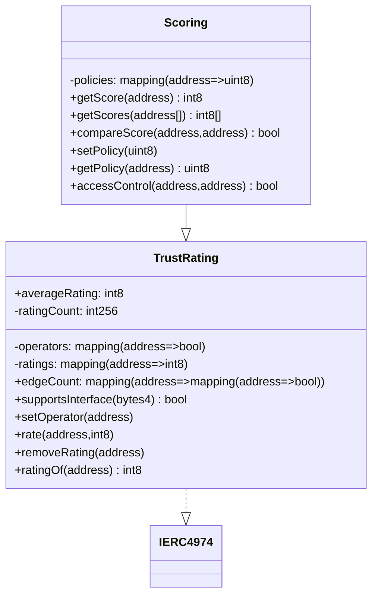
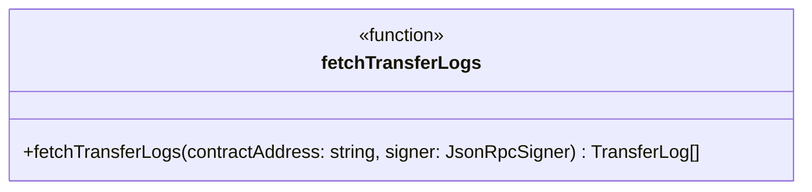
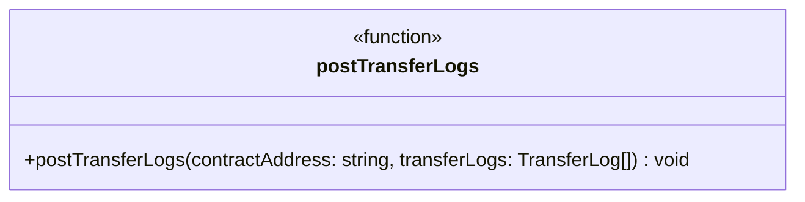
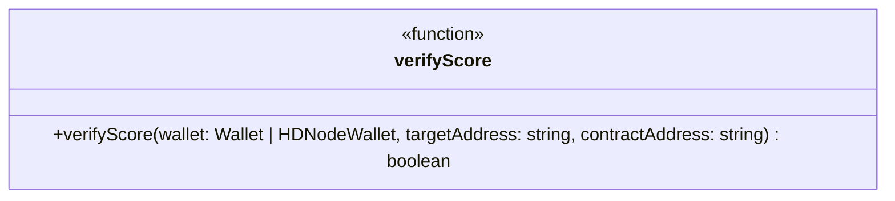

# Scoring

信用スコアリングシステムにおけるスマートコントラクトを用いたシステムである

1. 信用スコアの算出とアクセス制御(Scoring)
2. 信用スコアの管理(TrustRating)

## Overview

- [scoring.md](/docs/scoring.md): 信用スコアリングシステムの開発仕様書
- [Scoring.sol](/contracts/contracts/scoring/Scoring.sol): 信用スコアリングシステムのメインコード
- [Scoring.ts](/contracts/test/scoring/Scoring.ts): Scoring.solのテストコード
- [TrustRating.sol](/contracts/contracts/scoring/TrustRating.sol): Agentにより算出されたスコアの管理
- [IERC4974.sol](/contracts/contracts/scoring/IERC4974.sol): ERC4974のインターフェース

```mermaid
classDiagram
    class TrustRating {
        -operators: mapping(address=>bool)
        -ratings: mapping(address=>int8)
        +edgeCount: mapping(address=>mapping(address=>bool))
        +averageRating: int8
        -ratingCount: int256
        +supportsInterface(bytes4) bool
        +setOperator(address)
        +rate(address,int8)
        +removeRating(address)
        +ratingOf(address) int8
    }

    class Scoring {
        -policies: mapping(address=>uint8)
        +getScore(address) int8
        +getScores(address[]) int8[]
        +compareScore(address,address) bool
        +setPolicy(uint8)
        +getPolicy(address) uint8
        +accessControl(address,address) bool
    }

    TrustRating ..|> IERC4974
    Scoring --|> TrustRating
```

## Trust scoring

Trust Scoringではスマートコントラクトによる取引履歴に基づく信用スコアの算出とTrust Scoring Agentによる信用スコアの登録を行う

### Scoring.sol

[Scoring.sol](/contracts/contracts/scoring/Scoring.sol)は、　`TrustRating.sol` を継承し、信用スコアリングシステムの中核となるスマートコントラクトである。
信用スコアリングシステムが登録する外部評価を組み合わせて総合的なアクセス制御を実現する。
NFT取引前におけるアクセス制御を通じて、既知関係・外部評価といった複数の観点から取引可否を判断する。
これらの判断はユーザーが設定するポリシーに基づいたアクセス制御を実施する。

**アクセス制御機能**

- `getScore(address _user)`
    - アドレスを指定して信用スコアを取得する
    - 0アドレス指定時はリバートする
    - `TrustRating.ratingOf(_user)` を呼び出し、-127〜127 の `int8` スコアを返す
- `getScores(address[] memory _users)`
    - 複数ユーザーの信用スコアを一括取得
    - 各ユーザーに対して `getScore` を実行し、同じ並び順で配列に格納する
- `compareScore(address myAddress, address targetAddress)`
    - 自身と取引相手のスコア比較
    - 2アドレスともゼロアドレスを拒否
    - `myScore >= targetScore` なら `true`、それ以外は `false`
- `setPolicy(uint8 policy) / getPolicy(address user)`
    - アクセス制御ポリシーの設定・取得
    - `setPolicy` は呼び出し元アドレス `msg.sender` に対してポリシー値 0〜4 を設定する
    - `getPolicy` は任意ユーザーのポリシーを参照し、0アドレス指定時はリバートする
    - ポリシーの意味:
        - 0: アクセス制御なし(初期値)
        - 1: 通常ユーザー（自分のスコアが相手以上なら許可）
        - 2: 適応的ユーザー（スコア比較に加え、既知関係があれば許可）
        - 3: フリーライダー（自分のスコアが相手以上かつ平均スコア以上の場合のみ許可）
        - 4: 孤立ユーザー（常に拒否）
- `accessControl(address from, address to)`
    - ポリシーに応じた取引可否のアクセス制御を行う
    - `to` のポリシーを取得し、`from` / `to` 双方のスコアと `edgeCount`・`averageRating` を用いて取引可否を決定する
    - ポリシーごとの判定ロジック:
        - Policy 0: 常に許可
        - Policy 1: `fromScore >= toScore` のとき許可
        - Policy 2: `fromScore >= toScore` または `edgeCount[to][from]` もしくは `edgeCount[from][to]` が `true` のとき許可
        - Policy 3: `fromScore >= toScore` かつ `fromScore >= averageRating` のときのみ許可
        - Policy 4: 常に拒否

### Scoring.ts

[Scoring.ts](/contracts/test/scoring/Scoring.ts)では[Scoring.sol](/contracts/contracts/scoring/Scoring.sol)の信用スコアリングシステムの統合テストを実行する。
Scoring コントラクト単体の基本機能と、SsdlabToken と連携したポリシー別アクセス制御の動作を検証する。

1. **テストケース構成**

    **Scoring コントラクトの基本機能テスト**
    - `getScore` の初期値確認: 未評価ユーザーのスコアが 0 であることを検証
    - `getScores` の一括取得確認: 複数アドレスに対してスコア配列が返ることを確認
    - `setPolicy` / `getPolicy` の動作確認: 呼び出し元アドレスに対して任意のポリシー値を設定・取得できることを検証
    - スコア比較機能: `rate` でユーザーごとにスコアを設定し、自身と相手のスコア比較結果が期待通りになることを確認

    **SsdlabToken と連携したアクセス制御テスト**
    - ポリシー0（アクセス制御なし）: Policy 0を設定したユーザー間では常にNFT転送が成功することを検証
    - ポリシー1（通常ユーザー）: 高スコア → 低スコア の方向のみ取引可否になり、逆方向の転送はリバートすることを検証
    - ポリシー2（適応的ユーザー）: 過去の取引履歴が存在する場合はスコアが低い場合でも組み合わせにより取引が許可されるケースを検証
    - ポリシー3（フリーライダー）: スコアが高くても平均スコア未満の場合は取引が拒否となりNFT転送がリバートされることを検証
    - ポリシー4（孤立ユーザー）: Policy 4を設定したユーザーとの取引は常に拒否され、NFT転送がリバートされることを検証

### TrustRating.sol

[TrustRating.sol](/contracts/contracts/scoring/TrustRating.sol)は`IERC4974.sol`を継承し、信用スコアリングシステムの中核となるスマートコントラクトである。

**主要機能**

1. **オペレーター (Trust Scoring Agent) 管理機能**
    - `constructor(address _operator)`: 初期オペレーター設定
    - `setOperator(address _operator)`: 新しいTrust Score Agentの追加
    - `onlyOperator` modifier: オペレーターのみ実行可能な関数の制御

2. **外部評価管理機能（ERC4974準拠）**
    - `rate(address _rated, int8 _rating)`: Trust Score Agentによるスコア登録
    - `removeRating(address _removed)`: 登録済みスコアの削除
    - `ratingOf(address _rated)`: 外部評価スコアの取得
    - `_rating` は -127〜127 の範囲のみ許可され、それ以外はリバートする

3. **信用ネットワーク情報の管理機能**
    - `edgeCount(address from, address to)`: ユーザー間の既知関係の有無を管理するフラグでありPolicy 2 で「取引履歴の有無」として参照される
    - `averageRating`: すべての評価の単純平均を `int8` で保持

### IERC4974.sol

[IERC4974.sol](/contracts/contracts/scoring/IERC4974.sol)はTrust Scoring Agentが算出した信用スコアの値を`ERC4974`を用いて管理する

**ERC4974**
- Ethereumブロックチェーン上で数値評価を管理するための標準インターフェース
- 評価はint8型（-128～127の範囲）で管理され、ポジティブ・ネガティブ両方の評価が可能
- オペレーターが管理し、評価の付与・変更・削除を行える
    - 悪意のある評価操作を防ぐため、評価の更新・削除機能を提供
    - 評価を決める方法は実装者に委ねられている
- ERC165(コントラクトが特定のインターフェースをサポートしているか確認する仕組み)を継承している

## Frontend

- [fetchScores.ts](/frontend/src/components/scoring/fetchScores.ts): 自身と取引相手の信用スコアを取得する
- [fetchTransferLogs.ts](/frontend/src/components/scoring/fetchTransferLogs.ts): ブロックチェーン上のTrnsferLogを取得する
- [postTransferLogs.ts](/frontend/src/components/scoring/postTransferLogs.ts): ブロックチェーン上のTransferLogをTrust Scoring Systemへ送信する
- [verifyScore.ts](/frontend/src/components/scoring/verifyScore.ts): 自身と取引相手の信用スコアを比較してアクセス制御する

### fetchScores.ts

ユーザー自身と取引相手の信用スコアを取得する関数。

- 指定したユーザーアドレスリスト（targetAddressList）と自分のウォレットアドレスについて、スマートコントラクト（SsdlabToken）から信用スコアを取得する
- 取得したスコアはint8型（コントラクト内部値）を100で割ってnumber型に変換し返却する
- 取得したスコアは`targetScores`（取引相手のスコア配列）と`myScore`（自分のスコア）として返す

### fetchTransferLogs.ts

ブロックチェーン上のNFT Transferイベントログを取得し、TransferLog型の配列として返す関数。

- 指定したコントラクトアドレスのTransferイベントをブロック範囲ごとに効率的に取得し、ガス代やTokenURIなどの情報を付加して返す。
- 取得したログはpostTransferLogs.tsでAPI送信に利用される。
- 内部処理:
    1. 最新ブロック番号・ネットワーク情報を取得
    2. ブロック範囲ごとにTransferイベントをqueryFilterで取得
    3. 取得失敗時は範囲を細分化して再試行
    4. fromアドレスがゼロアドレスでないログのみ抽出
    5. 各ログについてガス代・TokenURIを取得し、TransferLog型に整形
    6. すべてのログを配列で返却

```mermaid
classDiagram
    class fetchTransferLogs {
        <<function>>
        +fetchTransferLogs(contractAddress: string, signer: JsonRpcSigner) TransferLog[]
    }
```

### postTransferLogs.ts

ブロックチェーン上のTransferLogをTrust Scoring System（外部API）へ送信する関数。

- 指定したコントラクトアドレスとTransferLog配列をAPIサーバーにPOSTし、スコアリングシステムに取引履歴を記録する
- ログが空の場合は送信せずに終了する
- TranferLogは`fetchTransferLogs.ts`を用いて取得する
- HTTPエラーやネットワークエラー時は例外をスローし、エラーログを出力

```mermaid
classDiagram
    class postTransferLogs {
        <<function>>
        +postTransferLogs(contractAddress: string, transferLogs: TransferLog[]) void
    }
```

### verifyScore.ts

自身と取引相手の信用スコアを比較し、取引可能かどうかを判定する関数。

- スマートコントラクトの`verifyScore`メソッドを呼び出し、
    自分（wallet.address）と取引相手（targetAddress）のスコアを比較する
- 自分のスコアが相手以上であれば`true`、そうでなければ`false`を返す

```mermaid
classDiagram
    class verifyScore {
        <<function>>
        +verifyScore(wallet: Wallet | HDNodeWallet, targetAddress: string, contractAddress: string) boolean
    }
```

### Reference

- Ethereum Improvement Proposals, ERC-4974: Ratings, [https://eips.ethereum.org/EIPS/eip-4974](https://eips.ethereum.org/EIPS/eip-4974)
- Ethereum Improvement Proposals, ERC-165: Standard Interface Detection, [https://eips.ethereum.org/EIPS/eip-165](https://eips.ethereum.org/EIPS/eip-165)
