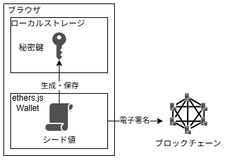
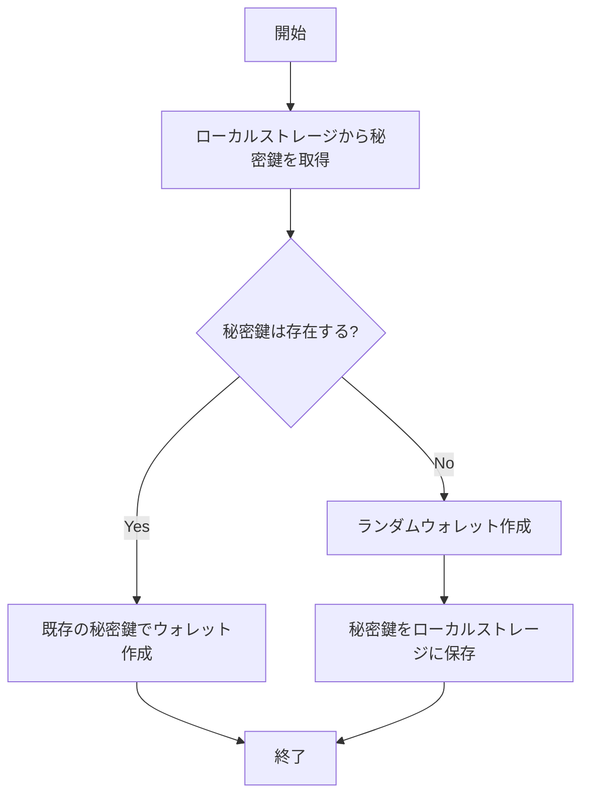
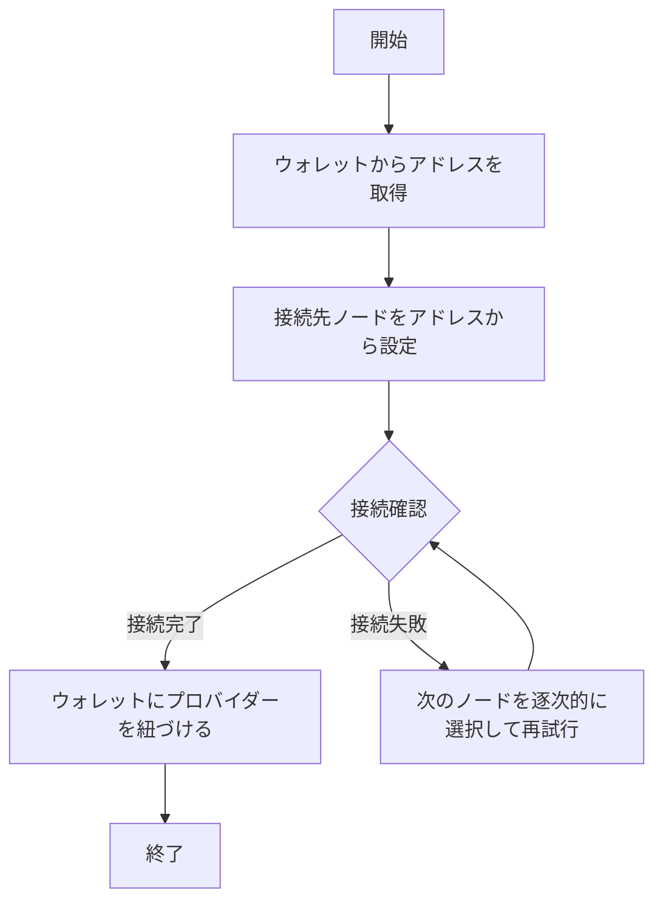

# Wallet

## Overview

本仕様書は、Ethereumブロックチェーンに接続するためのWalletの設計・実装方法について記述します。秘密鍵の管理、Walletの生成、ブロックチェーンとの接続手順を含み、参考リンクも併記する。

- **目的**  
  Ethereumネットワークへ接続するためのウォレットを提供し、秘密鍵の管理からブロックチェーンのノードへの接続までを自動化する。

- **前提条件**  
  - Web3-demo-appが実行可能な状態である
  - ブロックチェーンとウォレット(公開鍵暗号やウォレットアドレスなど)について学習済み

## System design

**システム全体の流れ**

1. 初期化: 必要な変数を宣言
2. ウォレット作成: ローカルストレージから既存の秘密鍵を取得しウォレットを作成
3. ノード接続: RPC URL選択と接続試行

いかにウォレット作成方法とノード接続方法について説明する。

### Create wallet

ウォレットは秘密鍵から作成されている。
秘密鍵はシード値から生成され、ブラウザのローカルストレージに保存される。

ウォレットは、以下の流れで作成される。

### Connect blockchain node

プロバイダーを活用したブロックチェーンのノードへ接続方法について紹介する

**接続先のノードをアドレスから選択する方法**

1. ウォレットアドレスの末尾1文字を16進数として解釈
2. RPC URLの配列長で割った余りを開始インデックスとして設定
3. 各ウォレットが異なるRPC URLから開始するように分散

例) 

- ウォレットアドレス: `0xf39Fd6e51aad88F6F4ce6aB8827279cffFb92266`
- ブロックチェーンのノード数: 4台

1. ウォレットアドレスの末尾である`6`を取得
2. ノード数で割った余りである $mod(6, 4) = 2$ を取得
3. ノード2に接続する

※もし接続できなければノード3, ノード0, ノード1と逐次的に再試行する

## Implement

`frontend/src/components/getWallet.ts`はウォレットを作成する関数である。
ブロックチェーンに接続し、署名を行うためのモジュールであるウォレットを[ethers.jsのWallet](https://docs.ethers.org/v6/api/wallet/)クラスを用いて実装している。

成功時：接続済みのウォレットと使用したRPC URLのインデックス
全て失敗時：プロバイダー未接続のウォレットとrpcUrlIndex: -1

**ウォレットの接続**

1. プロバイダー作成と接続テスト
    - JsonRpcProviderインスタンスを作成
    - ネットワーク情報取得（provider.getNetwork()）とタイムアウト（2秒）の競合処理
    - Promise.race()で先に完了した方の結果を採用
2 接続成功時
    - ウォレットにプロバイダーを接続
    - {wallet, rpcUrlIndex}オブジェクトを返却して処理終了
4.3 接続失敗時
    - エラーログを出力

最後のRPC URLでも失敗した場合：rpcUrlIndex: -1を返却
そうでなければ次のRPC URLを試行

## Test

本セクションでは、`getWallet.ts`の機能に対するテスト仕様を記述する。各テストケースは、ウォレット作成、ブロックチェーン接続、エラーハンドリングの観点から設計されている。

### 既存の秘密鍵がある場合

**目的**: ローカルストレージに保存された既存の秘密鍵を使用してウォレットが正しく復元されることを確認する。

**前提条件**:
- ローカルストレージに有効な秘密鍵（'secretKey'）が保存されている
- 有効なRPC URLが少なくとも1つ存在する

**テスト手順**:
1. ローカルストレージに既知の秘密鍵を設定
2. `getWallet(rpcUrls, localStorage)`を呼び出し
3. 返却されたウォレットのアドレスが既知の秘密鍵に対応することを確認

**期待結果**:
- 既存の秘密鍵から生成されたウォレットが返却される
- ウォレットのアドレスが期待値と一致する
- rpcUrlIndexが有効な値（0以上）である

### 秘密鍵が存在しない場合

**目的**: ローカルストレージに秘密鍵が存在しない場合、新しい秘密鍵が生成され保存されることを確認する。

**前提条件**:
- ローカルストレージに'secretKey'が存在しない、またはnull
- 有効なRPC URLが少なくとも1つ存在する

**テスト手順**:
1. ローカルストレージから'secretKey'を削除
2. `getWallet(rpcUrls, localStorage)`を呼び出し
3. ローカルストレージに新しい秘密鍵が保存されることを確認

**期待結果**:
- 新しいランダムウォレットが生成される
- 生成された秘密鍵がローカルストレージに保存される
- ウォレットが有効なアドレスを持つ

### 正常なRPC接続

**目的**: 有効なRPC URLに対して正常に接続できることを確認する。

**前提条件**:
- 接続可能な一つのRPC URLがリストが提供される
- ネットワークが利用可能である

**テスト手順**:
1. 有効なRPC URLsのリストを準備
2. `getWallet(rpcUrls, localStorage)`を呼び出し
3. 返却されたウォレットがプロバイダーに接続されていることを確認

**期待結果**:
- ウォレットがプロバイダーに正常に接続される
- wallet.providerが有効なJsonRpcProviderインスタンスである

### 接続タイムアウト

**目的**: RPC接続時のタイムアウトし逐次的に別のノードへ動作することを確認する。

**前提条件**:
- レスポンスが遅いまたは応答しないRPC URLが含まれる

**テスト手順**:
1. 応答しないRPC URLを含むリストを準備
2. `getWallet(rpcUrls, localStorage)`を呼び出し
3. タイムアウト後に次のRPC URLが試行されることを確認

**期待結果**:
- 次のRPC URLが自動的に試行される
- 最終的に有効なRPC URLに接続される（存在する場合）

### 全RPC URL接続失敗

**目的**: 全てのRPC URLが無効な場合のエラーハンドリングを確認する。

**前提条件**:
- 全てのRPC URLが無効または接続不可能である

**テスト手順**:
1. 無効なRPC URLのみを含むリストを準備
2. `getWallet(rpcUrls, localStorage)`を呼び出し
3. 返却値を確認

**期待結果**:
- ウォレットは生成されるが、プロバイダーに接続されない
- rpcUrlIndexが-1である
- エラーログが各無効RPC URLに対して出力される

### フローの検証

**目的**: ウォレット作成からプロバイダー接続、ETHの入金までを確認する

**テスト手順**:
1. 初期状態（秘密鍵なし）で`getWallet`を実行
2. 生成された秘密鍵を確認
3. ブロックチェーンのノードにプロバイダーを接続
4. 別のウォレットからETHの受け取る

**期待結果**:
- 初回実行時に新しいウォレットが生成される
- 両回とも有効なブロックチェーン接続が確立される
- 送金処理によりETHを受け取れることを確認する

## Reference

1. ethers.js
2. ethers.js wallet
