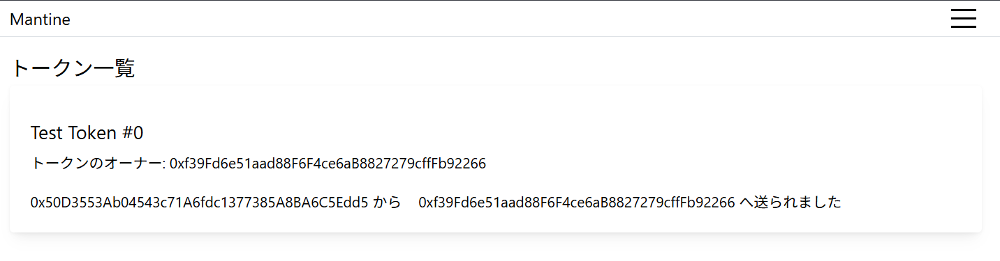
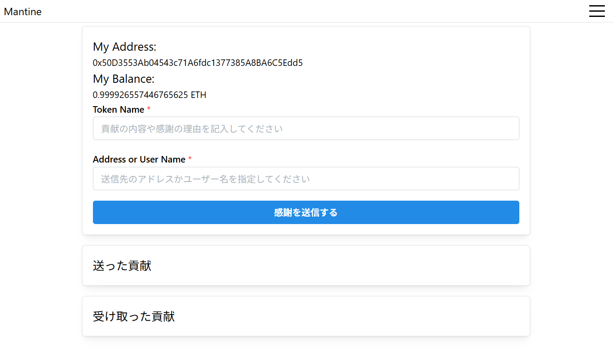
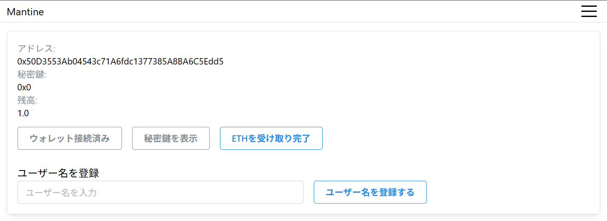
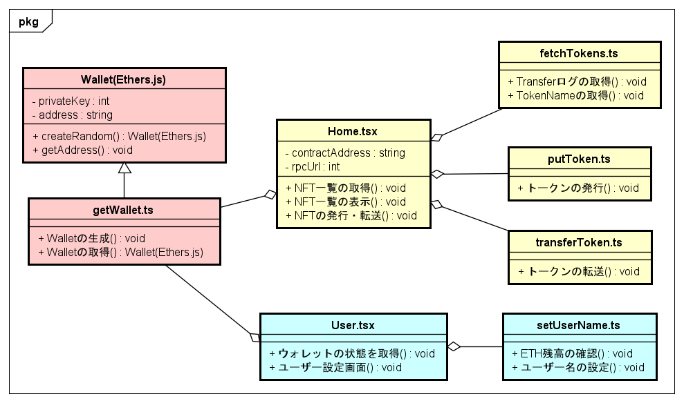

# Frontend Development

## User Interface

1. Home：
    ホーム画面では、発行されたNFT(Non-Fungible Token)一覧を確認することができる。
    発行されたNFTのトークン名やオーナー、感謝を受け取ったユーザーの確認が可能である。
    

2. Present：
    プレゼント画面では、NFTを利用した感謝の送信を行う。
    トークン名と送信先のアドレス(もしくはユーザー名)を指定して送信する。
    まずトークンを発行し、発行されたトークンを転送することで感謝の送信を行う。
    

3. User：
    ユーザー画面では、ウォレットの作成やETHの受け取りや会員証の発行をする。
    

4. Score:
    信用スコア算出のためにMetamaskのウォレットに接続し、NFTのTransfer logを取得する。
    取得後のログを[Trust Scoring System](https://github.com/C0A21130/trust-score/)に送信しグラフデータベースに取引ネットワークとして構造化し記録する。

## Frontend Architecture

フロントエンドでは、大きく分けて2つの機能に分けられる。

1. Wallet：ウォレットに関するクラス
    - getWallet
2. Contract Call：スマートコントラクトを呼び出すためのファイル
    - NFT: fetchToken, putToken, transferToken
    - 送金: transferEth
    - SBT: fetchCredential, issueCredential, verifyCredential
    - 信用スコア: fetchScore, verifyScore

以下にクラス図を示す。



### Wallet

`frontend/src/components/getWallet.ts`はウォレットを作成する関数である。
ブロックチェーンに接続し、署名を行うためのモジュールであるウォレットを[ethers.jsのWallet](https://docs.ethers.org/v6/api/wallet/)クラスを用いて実装している。
秘密鍵はシード値から生成され、ブラウザのローカルストレージに保存される。
より詳しく仕様について[wallet.md](./../docs/wallet.md)を参照する。


### Contract Call

1. トークンの取得
    `frontend/src/components/fetchToken.ts`はトークンを一覧として取得する関数である。
    まずスマートコントラクトにおけるTransferイベントのログ(トークンID、送信元アドレス、送信先アドレス)を取得する。
    取得したトークンのログからNFTのトークンのIDを取得し、トークン名等の情報(トークンの所有者、トークン名)を取得する。
    トークンの取得の方法は以下が存在する。
    - すべてのトークンを取得。
    - ウォレットから送信されたトークンを取得。
    - ウォレットが受信したトークンを取得。

2. トークンの発行
    `frontend/src/components/putToken.ts`は指定されたウォレットとスマートコントラクトを使用して新しいNFTトークンを発行する関数である。
    ウォレットの残高を確認し、十分なETHがあるかをチェックする。
    その後、スマートコントラクトの`safeMint`関数を呼び出してNFTを発行する。

3. トークンの転送
    `frontend/src/components/transferToken.ts`は、指定されたウォレットとスマートコントラクトを使用してNFTトークンを転送する関数である。
    ウォレットの残高を確認し、十分なETHがあるかをチェックする。
    その後、スマートコントラクトの`safeTransferFrom`関数を呼び出してNFTを発行する。

## How to

### Config Constant

各種設定が `frontend/src/App.tsx` ファイルに記載されている。
各自の環境に合わせて設定を変更する必要がある。

- rpcUrls: 接続するJSON-RPCサーバーのURLを一つ以上記載する
- contractAddress: 呼び出し先のスマートコントラクトのコントラクトアドレスを指定する
- credentialContractAddress: 呼び出し先のSBTのスマートコントラクトアドレスを指定する
- receiveAccountPrivateKey: ETHを受け取る先のアカウントの秘密鍵を指定する
- ipfsApiUrl: 接続するIPFSのノードのURLを指定する

### Start the Frontend Server

新しいターミナルを開き、開発用のフロントエンドサーバーを起動する。
コードが変更される度に変更が反映される。

```bash
cd frontend
npm run dev
```

### Run Tests

テストコードは `frontend/test` 内に `.test.ts`の拡張子で作成する。
JestとMocha, Chaiを活用してテストコードを作成する。

書き方
- it：一つのテストを記述する
    ```ts
    it("テスト名", function() {
      // テストを記述
    })
    ```
- describe：テストを複数記述する
    ```ts
    describe("テスト名", function() {
      it("テスト1", function() {
        // テストを記述
      })

      it("テスト2", function() {
        // テストを記述
      })
    })
    ```
- toBe：オブジェクトの等価判定をする
    ```ts
    expect("ABC").toBe("ABC") // True
    expect("ABC").toBe("ABD") // False
    expect(1+1).toBe(2) // True
    ```

作成したテストコードは以下のコマンドで実行する。

```bash
npm run test
```

ファイル名を指定することで、実行するテストコードを指定することも可能である。

```bash
npm run test test/<ファイル名>.test.ts
```

### Build the Frontend

開発が全て完了し、作成したコードを一つのコードにしたい場合は利用する。

```bash
cd frontend
npm run build
```

HTML・CSS・JSファイルが`frontend/dist/`に出力される。
出力されたファイルを利用するには以下のコマンドを実行する。

```bash
npm run preview
```

## Example

以下の練習問題は `contracts/README.md` の[Example](https://github.com/C0A21130/web3-demo-app/tree/main/contracts)を解き、理解していることが前提である。

### Smart Contract

- 課題1: スマートコントラクトのデプロイ
    - 問題1: スマートコントラクトをデプロイするためのTypeScriptのソースコードを `contracts/ignition/modules/` 内に作成する。
    作成するコードは `contracts/ignition/modules/SsdlabToken.ts` のソースコードを参考にする。
    - 問題2: Hardhat Nodeによる仮想ブロックチェーンにスマートコントラクトをデプロイする。
    contractディレクトリ内READMEの[Develop Smart Contract](../contracts/README.md#deploy-smart-contracts)を参考にする。
- 課題2: スマートコントラクトをコントラクトアドレスから呼び出す
    - 問題1: スマートコントラクトをコントラクトアドレスを用いてNFTを発行するTypeScriptのコードを `frontend/src/components` に作成する。
    作成する関数は、トークンの所有者(とトークンID)を引数とし、NFT発行のスマートコントラクトを呼び出す。
    作成したNFT発行のコードは `frontedn/test` 内にテストコードを作成して呼び出せることを確認する。
    - 問題2: スマートコントラクトをコントラクトアドレスを用いてNFTのオーナーアドレスを取得するTypeScriptのコードを `frontend/src/components` に作成する。
    作成する関数は、トークンIDを引数とし、オーナーアドレスを返り値とする。
    作成したコードは問題1と同様にテストを実施すること。

ヒント
- スマートコントラクトを呼び出す際にはethers.jsの[Contract](https://docs.ethers.org/v6/api/contract/)を利用する。
    ```ts
    const contract = new ethers.Contract(contractAddress, abi, signer);
    ```
    - contractAddress：呼び出すスマートコントラクトを指定するためのアドレス
    - abi：Solidityのスマートコントラクトをクライアントから呼び出すための情報
    - signer：コントラクトを実行するためのアカウント
- ABIとはSolidityのスマートコントラクトをクライアントから呼び出すための情報である。
    スマートコントラクトをコンパイルした際に、関数の引数や返り値が定義されたJSON形式のファイルが出力される。
    `contracts/artifacts/contracts`に出力されたJSONファイルを`frontend/abi`ディレクトリにコピーし、TypeScriptでインポートして利用する。
    ```ts
    import <ABI FILE> from "./../../abi/<ABI FILE>.json";
    const abi = <ABI FILE>.abi;
    ```
- コントラクトを実行するアカウント(Signer)は[Hardhat Node](https://hardhat.org/hardhat-network/docs/overview)を起動した際に出力をされるログを参照する。
    RPC_URLやPRIVATE_KEYを自身の環境に合わせて適時書き換える。
    ```ts
    const provider = new JsonRpcProvider("<RPC_URL>"); // ブロックチェーンとの通信のためクラス
    const signer = new Wallet("<PRIVATE_KEY>", provider); // トランザクションの署名のためのクラス
    ```
- 作成したスマートコントラクトを呼び出すコードのテストコードの作成・確認は[Run Tests](#run-tests)を参考にする。
- ブロックチェーンに書き込みを伴うスマートコントラクトを呼び出す際には、マイニングの待機処理を入れることを推奨する。
    ```ts
    const tx = await contract.call(); // 書き込みを伴うスマートコントラクトを呼び出す
    await tx.await(); // マイニングが終了しブロックが確定するまで待機する
    ```

### Frontend

- 課題1: タブを追加してNFT管理画面(UI)を作成する
    - 問題1: `frontend/src/components/Navbar.tsx`の`menuItems`を編集してNFTの管理画面へ移行するための画面をメニューに追加する。
        加えて'frontend/src/App.tsx'のルーティング(Routes)設定を編集する。
        ```ts
        const menuItems = [
            { icon: <IconHome size={16} />, label: 'Home', url: "/" },
            { icon: <IconGift size={16} />, label: 'Present', url: "/present" },
            { icon: <IconUser size={16} />, label: 'User', url: "/user" },
        ];
        ```
    - 問題2: `frontend/src/pages/`にTSXファイルを新規作成し、NFTの管理画面を作成する。
        作成するNFT管理画面には、必ずNFTの発行画面とNFTの表示画面を作成する。
        この時点では、実際にスマートコントラクトを呼び出す必要はない。
        発行画面の例)
        ```tsx
        const [tokenId, setTokenId] = useState(0); // ReactのuseStateを活用する
        const [owner, setOwner] = useState("0x0"); // ReactのuseStateを活用する

        return(
            <div>
                <Group> // 発行
                    <Text size="lg" className="mt-3">発行画面</Text>
                    <TextInput label="トークン名" value={tokenName} />
                    <Button variant="filled" color="blue"></Button>
                </Group>
                <Group> // NFTの表示
                    <Text size="lg" className="mt-3">トークン一覧</Text>
                    <Card>
                        <Text size="lg" className="mt-3">トークンID{tokenId}</Text>
                        <Text size="sm">トークンのオーナー{owner}</Text>
                    </Card>
                </Group>
            </div>
        ) 
        ```
- 課題2: NFT管理画面からNFTの発行とNFTの一覧確認する
    - 問題1: NFT管理画面からNFT発行をする。
    [Example Smart Contract](#smart-contract)課題2で作成したNFT発行の関数をインポートし、ボタンを押した際に呼び出すことでNFTの発行を実行する。
    ヒント)
    ```tsx
    const handle = async () => {
        const id = 2;
        setToken(id); // 発行するNFTのToken IDを更新する
        const tx = await mint(id); // インポートしたNFT発行関数を呼び出す
    }

    // 中略

    <Button variant="filled" color="blue" onClick={() => handle()}></Button>
    ```
    - 問題2: NFT管理画面からNFTの情報(オーナーのアドレス)を取得する。
    問題1と同様に、[Example Smart Contract](#smart-contract)課題2で作成したオーナーアドレスの取得をする関数をインポートし、実行する。
    本来であれば過去のNFT一覧全てを取得する必要があるが、本課題では自身が発行したNFTの情報のみを表示が出来れば可とする。
    ヒント)
    ```tsx
    const handle = async () => {
        // 略
        const tmp = await fetch(id) // インポートしたNFT発行関数を呼び出す
        setOwner(tmp); // オーナーの情報を更新する
    }
    ```

## Reference

- vite, https://ja.vite.dev/
- Hardhat, https://hardhat.org/
    - [Hardhat getting-started with hardhat ignition](https://hardhat.org/ignition/docs/getting-started)
- ethers, https://docs.ethers.org/v6/
    - [ethers.js Getting Started](https://docs.ethers.org/v6/getting-started/)
- react, https://ja.react.dev/
- mantine ui, https://ui.mantine.dev/
