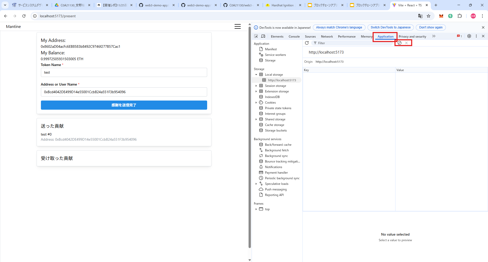

# Frontend Development

## User Interface

1. Home：
     ホーム画面では、発行されたNFT(Non-Fungible Token)一覧を確認することができる。
     発行されたNFTのトークン名やオーナー、感謝を受け取ったユーザーの確認が可能である。
     

2. Present：
     プレゼント画面では、NFTを利用した感謝の送信を行う。
     トークン名と送信先のアドレス(もしくはユーザー名)を指定して送信する。
     まずトークンを発行し、発行されたトークンを転送することで感謝の送信を行う。
     

3. User：
     ユーザー画面では、ウォレットの作成やETHの受け取り、ユーザー名の登録することができる。
     


## Contract Call

フロントエンドでは、大きく分けて2つの機能に分けられる。
以下にクラス図を示す。


### Wallet

`frontend/src/components/getWallet.ts`はウォレットを作成する関数である。
ブロックチェーンに接続し、署名を行うためのモジュールであるウォレットを[ethers.jsのWallet](https://docs.ethers.org/v6/api/wallet/)クラスを用いて実装している。
秘密鍵はシード値から生成され、ブラウザのローカルストレージに保存される。


ウォレットは、以下の流れで作成される。

1. ローカルストレージに保存されている秘密鍵を確認します。
2. 秘密鍵が存在する場合、その秘密鍵を使用してウォレットを生成します。
3. 秘密鍵が存在しない場合、新しいウォレットを生成し、その秘密鍵をローカルストレージに保存します。
4. ウォレットをEthereumプロバイダーに接続して返します。

### Token

1. トークンの取得
     `frontend/src/components/fetchToken.ts`はトークンを一覧として取得する関数である。
     まずスマートコントラクトにおけるTransferイベントのログ(トークンID、送信元アドレス、送信先アドレス)を取得する。
     取得したトークンのログからNFTのトークンのIDを取得し、トークン名等の情報(トークンの所有者、トークン名)を取得する。
     トークンの取得の方法は以下が存在する。
    - すべてのトークンを取得。
    - ウォレットから送信されたトークンを取得。
    - ウォレットが受信したトークンを取得。

2. トークンの発行
     `frontend/src/components/putToken.ts`は指定されたウォレットとスマートコントラクトを使用して新しいNFTトークンを発行する関数である。
     ウォレットの残高を確認し、十分なETHがあるかをチェックする。
     その後、スマートコントラクトの`safeMint`関数を呼び出してNFTを発行する。

3. トークンの転送
     `frontend/src/components/transferToken.ts`は、指定されたウォレットとスマートコントラクトを使用してNFTトークンを転送する関数である。
     ウォレットの残高を確認し、十分なETHがあるかをチェックする。
     その後、スマートコントラクトの`safeTransferFrom`関数を呼び出してNFTを発行する。

## Set Up

### Config

各種設定が `frontend/src/App.tsx` ファイルに記載されている。
各自の環境に合わせて設定を変更する必要がある。

- rpcUrls: 接続するJSON-RPCサーバーのURLを一つ以上記載する。
- contractAddress: 呼び出しを先のスマートコントラクトのコントラクトアドレスを指定する。
- receiveAccountPrivateKey: ETHを受け取る先のアカウントの秘密鍵を指定する。

### Start the Development Server

ブロックチェーンを起動する。
```bash
cd contracts
npx hardhat node
```

別のターミナルを開いて、コンパイルしたスマートコントラクトをブロックチェーンへデプロイする。
```bash
cd contracts
npx hardhat compile
npx hardhat ignition deploy ignition/modules/SsdlabToken.ts --network localhost
```

デプロイが成功すると以下のような出力がされるため、SsdlabTokenModule#SsdlabTokenのコントラクトアドレスをメモする。
```
Hardhat Ignition
Deploying [ SsdlabTokenModule ]
Batch #1
  Executed SsdlabTokenModule#SsdlabToken
  Executed SsdlabTokenModule#Test
[ SsdlabTokenModule ] successfully deployed
Deployed Addresses
SsdlabTokenModule#SsdlabToken - 0x5FbDB2315678afecb367f032d93F642f64180aa3
SsdlabTokenModule#Test - 0xe7f1725E7734CE288F8367e1Bb143E90bb3F0512
```
`frontend/src/App.tsx`のファイルを開いてコントラクトアドレス(contractAddress)を書き換える。

別のターミナルを開いて、フロントエンドのサーバーを起動する。
ブラウザで[http://localhost:5173](http://localhost:5173)を開いてアプリケーションを表示する。
```bash
cd frontend
npm run dev
```

もし秘密鍵やユーザー名を初期化する場合は、LocalStorageを消去する。
ブラウザの開発者ツール(F12)を開き、Applicationタブを開きClear ALLをクリックする。


### Run Tests

テストコードは `frontend/test` 内に `.test.ts`の拡張子で作成する。
MochaとChaiを活用してテストコードを作成する。

書き方
- it：一つのテストを記述する
    ```ts
    it("テスト名", function() {
      // テストを記述
    })
    ```
- describe：テストを複数記述する
    ```ts
    describe("テスト名", function() {
      it("テスト1", function() {
        // テストを記述
      })

      it("テスト2", function() {
        // テストを記述
      })
    })
    ```
- toBe：オブジェクトの等価判定をする
    ```ts
    expect("ABC").toBe("ABC") // True
    expect("ABC").toBe("ABD") // False
    expect(1+1).toBe(2) // True
    ```

作成したテストコードは以下のコマンドで実行する。
```bash
npm run test
```

ファイル名を指定することで、実行するテストコードを指定することも可能である。
```bash
npm run test test/<ファイル名>.test.ts
```

### Build the Frontend

```bash
cd frontend
npm run build
```

生成されたファイルは `frontend/dist/` に配置される。

## Example

以下の練習問題は `contracts/README.md` の[Example](https://github.com/C0A21130/web3-demo-app/tree/main/contracts)を解き、理解していることが前提である。

### Smart Contract

- 課題1: スマートコントラクトのデプロイ
     - 問題1: スマートコントラクトをデプロイするためのTypeScriptのソースコードを `contracts/ignition/modules/` 内に作成する。
     作成するコードは `contracts/ignition/modules/SsdlabToken.ts` のソースコードを参考にする。
     - 問題2: Hardhat Nodeによる仮想ブロックチェーンにスマートコントラクトをデプロイする。[Start the Development Server](#start-the-development-server)を参考にする。
- 課題2: スマートコントラクトをコントラクトアドレスから呼び出す
     - 問題1: スマートコントラクトをコントラクトアドレスを用いてNFTを発行するTypeScriptのコードを `frontend/src/components` に作成する。
     作成する関数は、トークンの所有者(とトークンID)を引数とし、NFT発行のスマートコントラクトを呼び出す。
     作成したNFT発行のコードは `frontedn/test` 内にテストコードを作成して呼び出せることを確認する。
     - 問題2: スマートコントラクトをコントラクトアドレスを用いてNFTのオーナーアドレスを取得するTypeScriptのコードを `frontend/src/components` に作成する。
     作成する関数は、トークンIDを引数とし、オーナーアドレスを返り値とする。
     作成したコードは問題1と同様にテストを実施すること。

参考URL
- [Hardhat getting-started with hardhat ignition](https://hardhat.org/ignition/docs/getting-started)
- [ethers.js Getting Started](https://docs.ethers.org/v6/getting-started/)

ヒント
- スマートコントラクトを呼び出す際にはethers.jsの[Contract](https://docs.ethers.org/v6/api/contract/)を利用する。
- 発行するアカウント(Signer)は[Hardhat Node](https://hardhat.org/hardhat-network/docs/overview)を起動した際に出力をされるログを参照する。
RPC_URLやPRIVATE_KEYを自身の環境に合わせて適時書き換える。
     ```ts
     const provider = new JsonRpcProvider("<RPC_URL>");
     const wallet = new Wallet("<PRIVATE_KEY>", provider);
     ```
- 作成したスマートコントラクトを呼び出すコードのテストコードの作成・確認は[Run Tests](#run-tests)を参考にする。
- ブロックチェーンに書き込みを伴うスマートコントラクトを呼び出す際には、マイニングの待機処理を入れることを推奨する。
     ```ts
     const tx = await contract.call(); // 書き込みを伴うスマートコントラクトを呼び出す
     await tx.await(); // マイニングが終了しブロックが確定するまで待機する
     ```

### Frontend

- 課題1: タブを追加してNFT管理画面(UI)を追加
     - 問題1: `frontend/src/components/Navbar.tsx`の`menuItems`を編集してNFTの管理画面へ移行するための画面をメニューに追加する。
          ```ts
          const menuItems = [
               { icon: <IconHome size={16} />, label: 'Home', url: "/" },
               { icon: <IconGift size={16} />, label: 'Present', url: "/present" },
               { icon: <IconUser size={16} />, label: 'User', url: "/user" },
          ];
          ```
     - 問題2: `frontend/src/pages/`にTSXファイルを新規作成し、NFTの管理画面を作成する。
     作成するNFT管理画面には、必ずNFTの発行画面とNFTの一覧表示を作成する。
     発行画面の例)
          ```tsx
          return(
               <div>
                    <Group>
                         <Text size="lg" className="mt-3">発行画面</Text>
                         <TextInput label="トークン名" value={tokenName} />
                         <Button variant="filled" color="blue"></Button>
                    </Group>
                    <Group>
                         <Text size="lg" className="mt-3">トークン一覧</Text>
                         <Card>
                              <Text size="lg" className="mt-3">トークンID</Text>
                              <Text size="sm" style={{ lineHeight: 1.5 }}>トークンのオーナー</Text>
                         </Card>
                    </Group>
               </div>
          ) 
          ```
- 課題2: NFT管理画面からNFTの発行とNFTの一覧確認
     - 問題1: NFT管理画面からNFT発行をする。
     [Example Smart Contract](#smart-contract)課題2で作成したNFT発行の関数をインポートし、ボタンを押した際に呼び出すことでNFTの発行を実行する。
     - 問題2: NFT管理画面からNFTの情報(オーナーのアドレス)を取得する。
     問題1と同様に、[Example Smart Contract](#smart-contract)課題2で作成したオーナーアドレスの取得をする関数をインポートし、実行する。
     本来であれば過去のNFT一覧全てを取得する必要があるが、本課題では自身が発行したNFTの情報のみを取得が出来れば可とする。

## Reference
- vite, https://ja.vite.dev/
- ethers, https://docs.ethers.org/v6/
- react, https://ja.react.dev/
- mantine ui, https://ui.mantine.dev/
